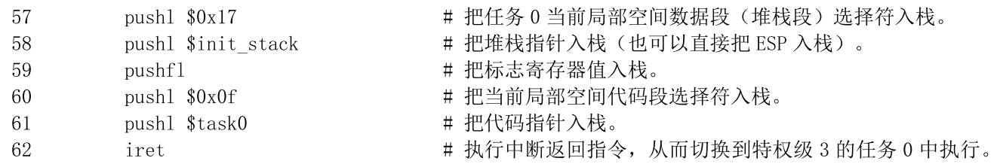

# 1 调试分析 Linux 0.00 引导程序
## 1.1 实验目的
* 熟悉实验环境；
* 掌握如何手写Bochs虚拟机的配置文件；
* 掌握Bochs虚拟机的调试技巧；
* 掌握操作系统启动的步骤；

## 1.2 实验内容
### 1.2.1 掌握如何手写Bochs虚拟机的配置文件
<div align="center"></div><center><font size=2 color=grey>图1 linux000_gui.bxrc</font></center>

* **简介Bochs虚拟机的配置文件**
  * **什么是Bochs**：Bochs是一个开源的x86 PC硬件模拟器，允许用户在其计算机上模拟x86架构的硬件和软件环境。它的主要用途是用于虚拟化，允许用户在模拟的环境中运行操作系统和应用程序，而无需实际的物理硬件。
  * **Bochs的配置文件**：Bochs运行后，会先查找配置文件，解析模拟器要虚拟的系统相关信息后启动系统。Bochs虚拟机的配置文件通常被命名为`.bochsrc`，它包含了一系列配置选项，用于定义虚拟机的硬件和软件设置。这个配置文件允许自定义虚拟机的行为，包括分配内存、加载操作系统镜像、配置硬盘和外设等。
* **如何设置从软驱启动**
    ```
    floppya: 1_44="Image", status=inserted
    boot: a
    ```
  * `floppya`表示虚拟软盘驱动器A
  * `1_44`指定虚拟软盘的类型：1.44MB的标准软盘
  * `Image`是虚拟软盘的映像文件路径和名称。这意味着在虚拟机启动时，Bochs会将这个映像文件加载到虚拟软盘驱动器A中
  * `status=inserted`表示虚拟软盘在虚拟机启动时被插入到驱动器中，以便虚拟机可以访问软盘上的内容
  * `boot: a`指定了启动设备，这里是虚拟软盘驱动器A。虚拟机将尝试从虚拟软盘A启动
* **如何设置从硬盘启动**
    ```
    # 设置虚拟硬盘参数
    ata0: enabled=1, ioaddr1=0x1f0, ioaddr2=0x3f0, irq=14
    ata0-master: type=disk, path="hard_disk.img", mode=flat, cylinders=100, heads=16, spt=63

    # 指定从硬盘启动
    boot: c
    ```
* **如何设置调试选项**
    ```
    log: bochsout.txt

    config_interface: win32config
    display_library: win32, options="gui_debug"
    ```
  * `log`选项指定日志文件路径。记录调试信息
  * `display_library`指定调试选项 

### 1.2.2 掌握Bochs虚拟机的调试技巧
* **如何单步跟踪？**
  * `Step[s]`按钮
  * 输入框中输入`s`
* **如何设置断点进行调试？**
  *  输入`b`或`vb`+地址 或 反汇编代码框里双击指令地址，再点击`Continue`按钮
* **如何查看通用寄存器的值？**
  * `info registers`命令查看通用寄存器的值
  * 使用`info registers <register_name>`命令来查看某个具体寄存器的值
* **如何查看系统寄存器的值？**
  * `sregs`命令
* **如何查看内存指定位置的值？**
  * `x /nuf <addr>`命令
* **如何查看各种表，如 gdt ，idt ，ldt 等？**
  * `info gdt`
  * `info idt`
  * `info ldt`
* **如何查看 TSS？**
  * `info tss`
* **如何查看栈中的内容？**
  * `print-stack`：显示当前任务状态段栈中的内容。  
* **如何在内存指定地方进行反汇编？**
  * `u [addr]`：反汇编指定地址开始的指令。
  * `u [addr] [count]`：反汇编指定地址开始的指定数量的指令。
  * `u [/m mode] [addr] [count]`：以指定的模式反汇编指定地址开始的指定数量的指令。

### 1.2.3 计算机引导程序
> boot.s为计算机引导程序，它先利用BIOS中断将内核代码（head.s）加载到内存0x1000处，再移动到内存0x0处，最后进入保护模式，跳转到内存0处开始执行

* **如何查看 0x7c00 处被装载了什么？**
1. `b 0x7c00`设置断点
2. `c`执行到断点处
3. `x /4bx 0x7c00`查看0x7c00地址开始4个字节的内容（以字节为单位）

* **如何把真正的内核程序从硬盘或软驱装载到自己想要放的地方**
1. 编写引导加载程序代码，引导加载程序位于硬盘的第一个扇区，它用于初始化硬件、加载内核程序到内存、跳转至内核的入口开始执行内核代码

* **如何查看实模式的中断程序？**
> 实模式下中断向量表位于内存地址`0x0000-0x03FF`，每个中断向量占用四个字节，前两个字节为段地址，后两个字节为偏移地址
>
> 实模式下地址有20位，每个地址寻址一个字节，一共能寻址1M的内存空间
1. 确定中断程序的中断号，中断号乘4可以得到中断向量在表中的偏移量，将`0x0`与偏移量相加可以得到中断向量的物理地址
2. 打开对应的物理地址，对其进行反汇编，查看汇编指令

* **如何静态创建 gdt 与 idt ？**
> `gdt`由多个段描述符组成，每个段描述符用于描述内存段的属性和访问权限;
> `idt`由多个中断描述符组成，每个中断描述符用于描述中断处理程序的入口和特权级等信息。
1. 在引导加载程序代码中定义`gdt`与`idt`的实例，为其分配足够内存空间
2. 对于`gdt`，为每个段描述符设置正确的值，包括段的基地址、限制、访问权限等。对于`idt`，为每个中断描述符设置正确的值，包括中断处理程序的偏移地址、段选择子、特权级等
3. 使用汇编指令`lgdt`和`lidt`将`gdt`和`idt`的地址加载到对应寄存器中

* **如何从实模式切换到保护模式？**
1. 关中断：使用`cli`指令禁用中断，确保在切换过程中不会被中断打断。
2. 创建并加载`gdt`：在保护模式下，内存分段和访问权限与实模式不同。创建`gdt`并使用`lgdt`指令将`gdt`的地址加载到`gdtr`寄存器中。
3. 设置控制寄存器：使用`mov`指令将合适的值加载到控制寄存器`CR0`中。设置`CR0`的最高位（位0）为1，启用保护模式。
4. 切换到保护模式：使用`jmp`指令跳转到标签或地址，这个标签或地址位于保护模式下的代码段。跳转指令将导致处理器从实模式切换到保护模式。

* **调试跟踪 jmpi 0,8 ，解释如何寻址？**
1. `0,8`的二进制表示为`0000 0000 0000 0000 0000 0000 0000 1000`
   1. 其中8赋值给`CS`，0赋值给`IP`，`CS`作为段选择子使用
2. 左4位`0000`表示内存偏移地址
3. 右2位`00`表示特权级为0
4. 右第3位`0`表示`gdt`表
5. 右第4位`1`表示`gdt`的索引
6. 最终将会跳转到`gdt`中第一个段描述符指向的地址（偏移量为0）

<div align="center"></div><center><font size=2 color=grey>图2 段选择子</font></center>
  
## 1.3 实验报告
### 1.3.1 请简述 head.s 的工作原理
#### 1.3.1.1 head.s工作状态
1. 现象：如图3所示，head.s执行时会不断地在屏幕中输出字符A和B（输出10个A后输出10个B，循环往复）
2. 解释：head.s中`task0`可以打印字符A，`task1`可以打印字符B。当执行`task0`打印A至发生时钟中断后，会跳转到`task1`打印B，而`task1`触发时钟中断后又会回到`task0`执行打印A，如此反复

<div align="center"></div><center><font size=2 color=grey>图3 屏幕状态</font></center>

#### 1.3.1.2 head.s工作原理
> * 1-3步在内核模式下执行，执行内核启动代码对寄存器、栈、GDT、IDT等进行初始化
> * 4在用户模式下执行，在屏幕中输出字符A和B
1. 首先加载数据段寄存器`DS`和堆栈段寄存器`SS`和堆栈指针`ESP`
   1. `boot.s`建立的临时GDT表的第三项为数据段选择符，所以`DS`加载`0x10`
   2. `SS`也加载`0x10`，同数据段选择符
2. 在新的位置初始化IDT（中断描述符表）和GDT表，并重新加载所有的段寄存器。此时为真正意义的IDT和GDT表，不同于boot.s中为了jmpi0,8而临时建的表。除此之外，还执行：
   1. 设置8253定时芯片（每10ms向中断控制器发送一个中断请求信号）
   2. 将IDT表的第8和第128项设置为定时中断门描述符和系统调用陷阱门描述符
3. 将`task0`的东西入栈（营造中断返回的场景），并模拟中断返回，从内核模式（特权级0）切换到用户模式（特权级3）执行`task0`
   1. 加载`task0`的TSS段描述符到`TR`（任务寄存器）、LDT段描述符到`LDTR`(局部描述符表寄存器)
   2. 将`task0`的局部数据段选择子（LDT表第三项的索引`0x17`）、局部代码段选择子（LDT表第二项的索引`0x0f`）等入栈
   3. 执行中断返回，刚刚入栈的东西出栈，进而切换到用户级并开始执行`task0`
4. 在用户模式下执行`task0`的代码，通过调用`int 0x80`中段打印字符A，并`loop 1b`延迟循环
   1. 10ms后响应8253的中断请求信号，执行`0x08`中断，该中断将任务切换至`task1`
5. 在用户模式下执行`task1`的代码，打印字符B，当10ms后切换回`task0`，如此往复

### 1.3.2 请记录 head.s 的内存分布状况，写明每个数据段，代码段，栈段的起始与终止的内存地址

#### 1.3.2.1 GDT
<div align="center"></div><center><font size=2 color=grey>图4 GDT</font></center>

|  名称 | 起始地址 | 终止地址 |
|---|---|---|
| 内核代码段 | 0x0 | 0x7fffff |
| 内核数据段 | 0x0 | 0x7fffff |

#### 1.3.2.2 LDT
> LDT0的地址：`0xbe0`；LDT1的地址：`0xe60`

<div align="center"></div><center><font size=2 color=grey>图5 LDT0</font></center>
<div align="center"></div><center><font size=2 color=grey>图6 LDT1</font></center>

如图5第二项，基地址为`0x0`；`s`为1，`type`为b，为代码段；D/B为1，段限长为0x3ff，段大小为`(0x3ff+1)*0x1000=0x400000B`(1页=4KB=4096B=4096字节)，所以结束地址为0x3fffff。同理可以得到其它项。

|  名称 | 起始地址 | 终止地址 |
|---|---|---|
| 局部代码段 | 0x0 | 0x3fffff |
| 局部数据段 | 0x0 | 0x3fffff |

#### 1.3.2.3 内存分布状况
> 通过在0x7c00、0x0处设断点，查看到head.s在内存中的状况，结合.s代码可以得到每个数据段、代码段、栈段的分布情况

1. 代码段：task0起始地址由`push 0x10e0`得到
    | 代码段编号     | 名称               | 起始地址     | 终止地址                   |
    | -------------- | ------------------ | ------------ | -------------------------- |
    | 1              | `startup_32`       | `0x00`       | `0xac`                     |
    | 2              | `setup_gdt`        | `0xad`       | `0xb4`                     |
    | 3              | `setup_idt`        | `0xb5`       | `0xc7`                     |
    | 4              | `rp_sidt`          | `0xcd`       | `0xe4`                     |
    | 5              | `write_char`       | `0xe5`       | `0x113`                    |
    | 6              | `ignore_int`       | `0x114`      | `0x129`                    |
    | 7              | `timer_interrupt`  | `0x12a`      | `0x165`                    |
    | 8              | `system_interrupt` | `0x166`      | `0x17c`                    |
    | 9              | `task0`            | `0x10e0`     | `0x10f3`                   |
    | 10             | `task1`            | `0x10f4`     | `0x1107`                   |
2. 数据段
    | 数据段编号 | 名称         |起始地址 | 终止地址              |
    | -------------- | ------------------ | ------------ | -------------------------- |
    | 1              | `current`          | `0x17d`      | `0x180`                    |
    | 2              | `scr_loc`          | `0x181`      | `0x184`                    |
    | 3              | `lidt_opcode`      | `0x186`      | `0x18b`                    |
    | 4              | `lgdt_opcode`      | `0x18c`      | `0x191`                    |
    | 5              | `idt`              | `0x198`      | `0x997`                    |
    | 6              | `gtd`              | `0x998`      | `0x9d7`                    |
    | 7              | `ldt0`             | `0xbe0`      | `0xbf7`                    |
    | 8              | `tss0`             | `0xbf8`      | `0xc5f`                    |
    | 9              | `ldt1`             | `0xe60`      | `0xe77`                    |
    | 10             | `tss1`             | `0xe78`      | `0xedf`                    |
3. 栈段：通过`init_stack`的地址及栈空间大小`128*4字节`可以得到内核栈的起始和终止地址；其他栈同理，需要先查gdt再查tss得到`krn_stk0`的地址
    | **堆栈段编号** | **名称**           | **起始地址** | **终止地址**               |
    | -------------- | ------------------ | ------------ | -------------------------- |
    | 1              | `init_stack`       | `0x9d8`      | `0xbd7`   |
    | 2              | `krn_stk0`         | `0xc60`      | `0xe5f` |
    | 3              | `krn_stk1`         | `0xee0`      | `0x10df`|
    | 4              | `user_stk1`       | `0x1108`     | `0x1307` |

### 1.3.3 简述 head.s 57 至 62 行在做什么？
<div align="center"></div><center><font size=2 color=grey>图7</font></center>

1. 代码说明
   * 57：把任务0局部空间数据段选择符入栈
   * 58：把堆栈指针入栈
   * 59：把标志寄存器值入栈
   * 60：把任务0局部空间代码段选择符入栈
   * 61：把代码指针入栈
   * 62：执行中断返回指令
2. 详细解释
   * `CS:EIP`变为`0x0f:0x10e0`
     * CS（代码段寄存器）：存储当前正在执行的代码所在的段（segment）的**段选择子**（注意不是段基地址，段基地址需要用段选择子查找得到）
     * EIP（指令指针寄存器）：存储当前正在执行的指令的**偏移地址**
   * `SS:ESP`变为`0x17:0xbd8`
     * SS（堆栈段寄存器）：存储当前堆栈所在段的段选择子
     * ESP（堆栈指针寄存器）：存储着堆栈顶部的内存地址
     * 此时原来的内核栈变为了任务0的用户栈
   * 使用`iret`是因为：CPU 允许低级别（如特权级3）代码通过调用门或中断、陷阱门来调用或转移到高级别代码中运行，但反之则不行。但可以通过`iret`中断返回转移到低级别的代码段执行。

### 1.3.4 简述 iret 执行后， pc 如何找到下一条指令？
`iret`指令用于从中断处理程序中返回到被中断的程序，并恢复被中断程序的现场。执行`iret`指令后，处理器会执行以下操作：

1. 弹出CS和EIP寄存器的值，以恢复被中断程序的代码指针。
2. 弹出EFLAGS寄存器的值，以恢复被中断程序的标志位。
3. 弹出SS和ESP寄存器中的值，以恢复被中断程序的堆栈指针。

因此，`iret`指令执行后，程序计数器PC将指向被中断程序被中断前执行的下一条指令。具体来说，`iret`指令会将从堆栈中弹出的CS和EIP寄存器的值组合成一个32位的线性地址(CS作为段选择子查表找到基地址，再加上EIP偏移地址得到线性地址)，然后将该线性地址存储在程序计数器PC中，以便继续执行被中断程序被中断前的指令。

其中取基地址过程如下：CS为`0000 0000 0000 1111`，其中后两位表示特权级3，倒数第三位表示LDT表，倒数第四位表示第二项。段寄存器会从LDTR所指向的LDT表的段描述符1中取出段基址（段描述符特权级为3，CPL>=DPL，则可以访问段基址）
### 1.3.5 记录 iret 执行前后，栈是如何变化的？

1. 执行前，栈中内容为57-61行代码入栈的内容（栈底由`init_stack`得到），同时可以观察左侧`SS:ESP`和`CS:EIP`
    <div align="center"></div><center><font size=2 color=grey>图8 执行前</font></center>
2. 执行后，栈中内容被清空，栈底没变（栈底由`init_stack`得到），栈顶改变，同时可以观察左侧`SS:ESP`和`CS:EIP`变化。注意此过程中除了发生1.3.4中的指令切换外，还发生堆栈切换（通过SS查表找到基地址）（原来的内核栈空间变为任务0用户栈空间）
    <div align="center"></div><center><font size=2 color=grey>图9 执行后</font></center>

### 1.3.6 当任务进行系统调用时，即 int 0x80 时，记录栈的变化情况。

1. 执行前，`esp`=0xbd8，`ss`=0x17（基地址为0x0），栈为空
  
<div align="center"></div><center><font size=2 color=grey>图10 执行前</font></center>

2. 执行中，陷阱门描述符的DPL为3（访问陷阱门的代码特权级为3，可以访问），与入口点偏移为0x166（载入`EIP`），类型为陷阱门，段选择符为0x8（载入`CS`查GDT表得到基地址为0x0，目标代码特权级为0），得到目标代码线性地址为0x166
  
<div align="center"></div><center><font size=2 color=grey>图11 0x80门描述符</font></center>
  
此时CPL为3、门描述符DPL为3、门选择符RPL为3、目的代码段描述符DPL为0，进行特权级检查，此时CPL被目标代码的DPL刷新，处理器切换到内核模式，引起堆栈切换
  
<div align="center"></div><center><font size=2 color=grey>图12 特权级检查</font></center>

3. 执行后，CPU从当前任务的任务状态段TSS 0中取出新堆栈(任务0的内核栈空间krn_stk0)的段选择符和偏移值`ss0`和`esp0`（`ss0`找到内核数据基地址0x0），随后切换到新堆栈，并把原任务0用户栈指针`ss`和`esp`压入任务0内核态堆栈，随后把标志寄存器`eflags`的内容和返回位置`cs`、`eip`压入任务0内核态堆栈
  
<div align="center"></div><center><font size=2 color=grey>图13 执行后</font></center>
  
栈中的内容依次为（栈底在0x0e60）：`0x10eb`(原EIP/中断指令 的下一条指令偏移)；`0x0f`(原CS选择子的值)；`0x0246`(EFLAGS的值)；`0x0bd8`(原ESP的值)；`0x17`(原栈堆SS寄存器的值)

## 1.4 其他
1. 执行.bat文件前需要先将bochs所在文件夹添加至环境变量
```
bochsdbg -q -f Linux000_gui.bxrc
```
2. 1字节=8位二进制=2位十六进制，实模式下一个内存地址（20位）寻址一个字节
3. [X86_64常用寄存器](https://zhuanlan.zhihu.com/p/609024025)
4. 保护模式下的段寄存器被当成段选择子来使用（实模式下左移四位为基地址），包括CS、SS、DS、ES、FS，通过选择子到GDT表或LDT表去查找真正的代码段或数据段的段地址，然后再与偏移地址相加得到物理地址
5. head.s的GDT表
    |索引|内容|
    |---|---|
    | 0x0 | 空 |
    | 0x08 | 内核代码段描述符 |
    | 0x10 | 内核数据段描述符 |
    | 0x18 | 屏幕显示内存段描述符 |
    | 0x20 | 任务0的TSS段描述符 |
    | 0x28 | 任务0的LDT段描述符 |
    | 0x30 | 任务1的TSS段描述符 |
    | 0x38 | 任务1的LDT段描述符 |
6. <div align="center"></div><center><font size=2 color=grey>图14 段描述符</font></center>
7. `.word`指令分配2字节的内存空间用于存数据
8. `.long`指令分配4字节的内存空间用于存数据。常用于存地址。
9. `.fill`指令常用于分配堆栈空间、IDT空间等数据空间
10. `.align 3`：后续位置对齐到2^3=8字节位置
11. `current:.long 0`：.long分配了32字节的内存空间，并存入数据0，同时代码中current标签均会变为此内存空间的地址，之后如果要使用或更改此内存空间的数据，只需要数据current标签即可（current可以视为变量名）
12. 高特权级代码通常可以访问低特权级数据，但不会直接调用低特权级别的代码