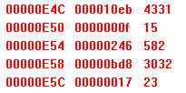
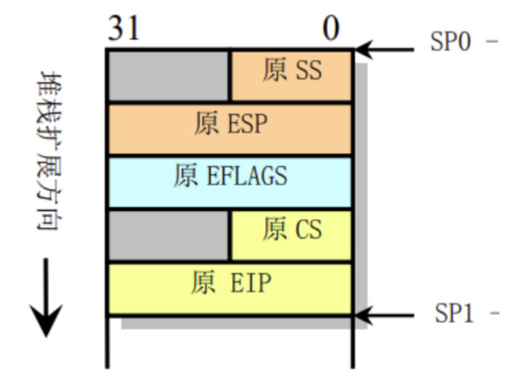
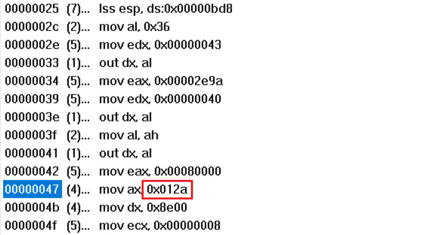
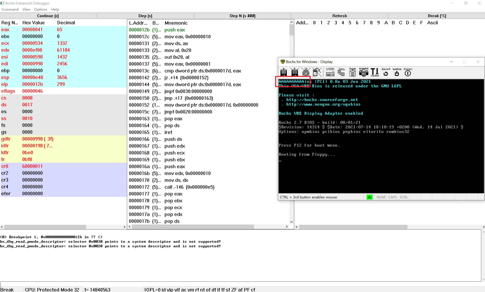
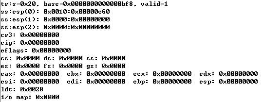
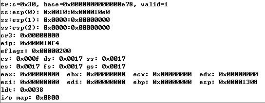
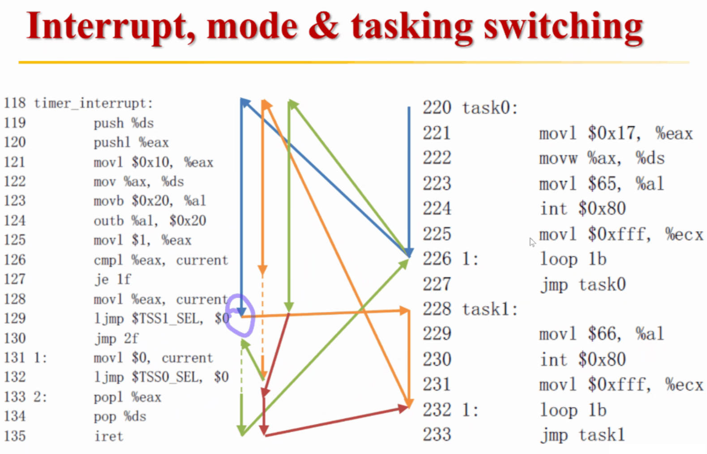

# 2 调试分析 Linux 0.00 多任务切换

## 2.1 实验内容
通过调试一个简单的多任务内核实例，使大家可以熟练的掌握调试系统内核的方法。 这个内核示例中包含两个特权级 3 的用户任务和一个系统调用中断过程。我们首先说明这个简单内核的基本结构和加载运行的基本原理，然后描述它是如何被加载进机器 RAM 内存中以及两个任务是如何进行切换运行的。

## 2.2 实验报告

### 2.2.1 当执行完 system_interrupt 函数，执行 153 行 iret 时，记录栈的变化情况。

1. 执行`iret`前，栈内为执行`int $0x80`时压入栈的`CS:EIP`、`EFLAGS`、`SS:ESP`，其中`CS:EIP`指向`int $0x80`下一条指令地址

图1 iret执行前

2. 执行`iret`中，程序依次弹出栈中的`CS:EIP`、`EFLAGS`、`SS:ESP`

图2 iret执行中弾栈

3. 执行`iret`后发生跳转，回到任务0的代码段，即`CS:EIP`指向指令（`int $0x80`下一条指令），栈段也切回任务0之前的栈段

图3 iret执行后，原任务0的栈顶为空，此时也为空

### 2.2.2 当进入和退出 system_interrupt 时，都发生了模式切换，请总结模式切换时，特权级是如何改变的？栈切换吗？如何进行切换的？

> 进入和退出`system_interrupt`时特权级改变，同时栈切换

1. **特权级改变**
   1. 进入`system_interrupt`时，从用户模式到内核模式，特权级由3变为0
      1. CPU 允许低级别代码通过调用门或中断、陷阱门来调用或转移到高级别代码中运行（注意反之不行）
      2. 进入`system_interrupt`时，为低级调用高级，允许调用，并进行特权级检查，此时CPL为3、门描述符DPL为3、门选择符RPL为3、目的代码段描述符DPL为0，CPL被目标代码的DPL刷新，处理器切换到内核模式
   2. 离开`system_interrupt`时，从内核模式到用户模式，特权级由0变为3
      1. 从高级能通过`iret`中断返回转移到低级别的代码段执行（同之前营造堆栈并`iret`）
      2. `CS:EIP`出栈，`CS`标志着由内核模式切换至用户模式
2. **堆栈切换**
   1. 进入`system_interrupt`时，从任务0的用户态堆栈切换到任务0的内核态堆栈
      1. CPU从任务0的任务状态段TSS 0中取出新堆栈(任务0的内核栈空间krn_stk0)的段选择符和偏移值`ss0`和`esp0`（`ss0`找到内核数据基地址0x0），随后切换到新堆栈(任务0的内核栈空间，也就是任务0内核态堆栈)，并把原任务0用户栈指针`ss`和`esp`压入任务0内核态堆栈，随后把标志寄存器`eflags`的内容和返回位置`cs`、`eip`压入任务0内核态堆栈
   2. 离开`system_interrupt`时，从任务0的内核态堆栈切换到任务0的用户态堆栈
      1. 通过`iret`弹出`SS:ESP`实现栈切换

### 2.2.3 当时钟中断发生，进入到 timer_interrupt 程序，请详细记录从任务 0 切换到任务 1 的过程。
#### 2.2.3.1 操作过程

1. 结合汇编代码找到`timer_interrupt`程序的地址，地址为`0x012a`
   

图4 timer_interrupt 程序地址

2. 在`0x012b`处设置断点，当第一次进入`timer_interrupt`程序时，屏幕已经输入几个A了，但还未输出B

图5 第一次进入timer_interrupt

3. ​ 单步执行直到处理器将要执行转移指令`jmpf 0x30:0`，转移指令中`0x30`为`TSS1`的选择子，未执行转移指令时，TSS为任务0的

图6 转移前的TSS

4. 执行转移指令后，程序跳转至`0x10f4`，切换到任务1，同时TSS也发生切换，切换为任务1的

图7 转移后的TSS

#### 2.2.3.2 实际过程
> `ljmp $TSS1_SEL, $0`的详细过程
1. 首先加载任务1的TSS选择子，即`$TSS1_SEL`
2. CPU通过TSS选择子从GDT中找到任务1的TSS描述符
3. 将切换前的所有状态（寄存器等）存入任务0的TSS段中，需要注意的是存入的`CS:ESP`是`ljmp $TSS1_SEL, $0`下一条指令`jmp 2f`的地址
4. 通过TSS描述符从任务1的TSS段中取出任务1的状态，主要包括
   1. `CS:EIP`：`0x0f:task1`（任务1的代码起始位置）
   2. `SS:ESP`：`0x17:urn_stk1`（任务1的用户栈）
   3. `LDT`：`LDT1_SEL`（任务1的LDT选择符）
5. 跳转至`0x0f:task1`执行任务1，栈由任务0的内核栈段切换至任务1的用户栈段，任务0的内核模式切换到任务1的用户模式

### 2.2.4 又过了 10ms ，从任务1切换回到任务 0 ，整个流程是怎样的？ TSS 是如何变化的？各个寄存器的值是如何变化的？
1. 任务1执行`loop 1b`指令循环，循环打印字符B，10ms后发生时钟中断
2. 进入`timer_interrupt`，切换至任务1的内核模式
3. 由于此时的current为1，`timer_interrupt`执行的是`ljmp $TSS1_SEL, $1`
   1. 加载任务0的TSS选择子
   2. 将当前寄存器的值存到任务1的TSS段中，需要注意的是存入的`CS:ESP`是`ljmp $TSS1_SEL, $1`下一条指令`popl %eax`的地址
   3. 从任务0的TSS中加载上次保存的状态，此时设置`CS:ESP`指向的指令为`jmp 2f`
4. 执行后，栈由任务1的内核栈段切换至任务0的内核栈段，同时由任务1的内核模式切换到任务0的内核模式，特权级不发生改变

### 2.2.5 请详细总结任务切换的过程。
1. 获取TSS选择子
   1. 从JMP或CALL指令的操作数（本代码）
   2. 从任务门中
   3. 从当前TSS段的前一任务链接字段
2. CPU使用TSS选择子在GDT中查找TSS描述符（需要是available的）
3. 进行特权级检查
   1. JMP或CALL：CPL（当前CS得到）≤DPL（TSS描述符得到）、RPL（TSS选择子得到）≤DPL（TSS描述符得到）
   2. IRET：不用在意特权级
4. 将当前任务的状态保存在当前任务的TSS段中（此时任务寄存器还是原来的TSS选择子；注意存入的指令地址为当前指令的下一条指令的地址）
5. 发生TSS selector切换。新的TSS选择子被加载到TR.selector，而新的TSS描述符也被加载到TR寄存器的隐藏部分
6. CPU从新的TSS段中加载新状态。把新任务的状态加载进处理器。这包括LDTR寄存器、PDBR（CR3）寄存器、EFLAGS寄存器、EIP寄存器以及通用寄存器和段选择符等。在此期间检测到的任何错误都将出现在新任务的上下文中。
   1. 在这一步，从TSS段加载CS之前，还必须经过相关的常规检查以及权限检查。通过之后才真正加载。
   2. CPU同时还要做另一项工作，即将GDT中旧进程的TSS描述符置为available状态，新进程的TSS描述符置为busy状态，使得新进程不能重入。
7. CPU从新的CS:ESP继续往下执行，开始执行新任务（对于异常处理过程，新任务的第一条指令显现出还没有执行）。

图8 执行过程

## 2.3 其它
1. 为什么第一次执行`ljmp $TSS1_SEL, $0`切换任务时能从内核态切换为用户态