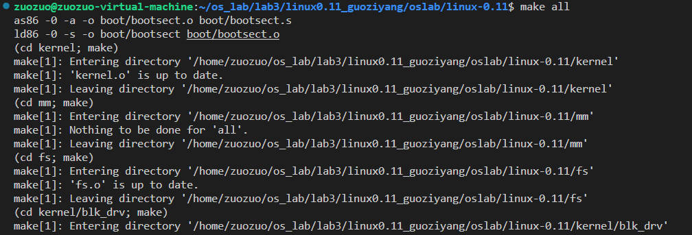
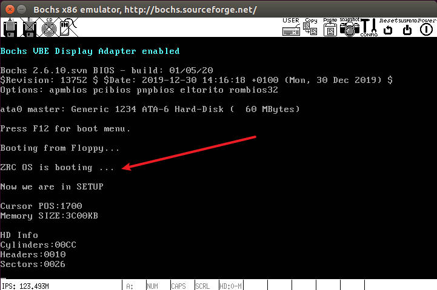
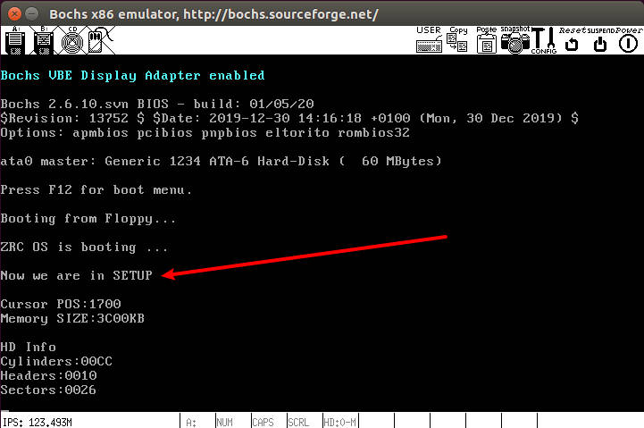
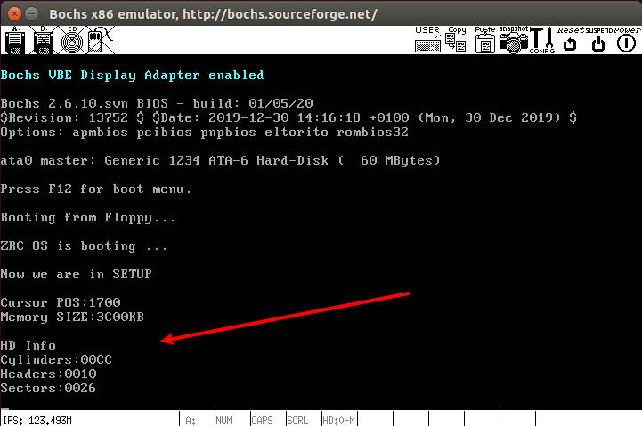
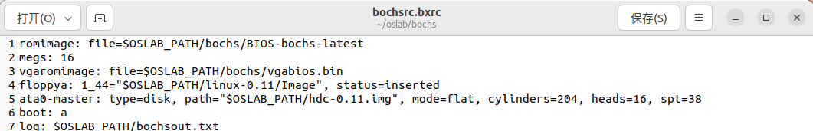

# 3 操作系统的引导
## 3.1 实验目的
- 熟悉实验环境；
- 建立对操作系统引导过程的深入认识；
- 掌握操作系统的基本开发过程；
- 能对操作系统代码进行简单的控制，揭开操作系统的神秘面纱。
## 3.2 实验内容
1. 阅读《Linux内核完全注释》的第 6 章，对计算机和 `Linux 0.11` 的引导过程进行初步的了解；
2. 按照下面的要求改写`Linux 0.11`的引导程序 `bootsect.s` ;
3. 有兴趣同学可以做做进入保护模式前的设置程序 `setup.s` 。
### 3.2.1 改写bootsect.s
1. 修改`bootsect.s`中msg1打印的内容
    ```
    msg1:
        .byte 13,10
        .ascii "ZRC OS is booting ..."
        .byte 13,10,13,10
    ```
2. 通过linux的`wc`命令计算字符串长度
<div align="center"></div><center><font size=2 color=grey>图1 wc命令</font></center>

3. 找到print的代码，设置打印内容的长度为21+2*3=27(开头有一个回车，结尾有两个回车)
    ```
    ! Print some inane message

        mov	ah,#0x03		! read cursor pos
        xor	bh,bh
        int	0x10
        
        mov	cx,#27
        mov	bx,#0x0007		! page 0, attribute 7 (normal)
        mov	bp,#msg1
        mov	ax,#0x1301		! write string, move cursor
        int	0x10
    ```
4. 编译后执行
<div align="center"></div><center><font size=2 color=grey>图2 在linux-0.11下输入 ./make all 编译</font></center>
<div align="center"></div><center><font size=2 color=grey>图3 在oslab下输入 ./run 执行</font></center>

### 3.2.2 改写`setup.s`
#### 3.2.2.1 输出一行句子
> bootsect.s 能完成 setup.s 的载入，并跳转到 setup.s 开始地址执行。而 setup.s 向屏幕输出一行 `Now we are in SETUP`
1. 参照着`bootsect.s`中输出文字的代码改写`setup.s`以实现输出句子（注意修改`es`寄存器中存储的段偏移地址）
    ```
    entry start
    start:
        mov	ax,#SETUPSEG    ! es:bp为待打印字符串的地址
        mov	ds,ax
        mov	es,ax

        mov	ah,#0x03		! read cursor pos
        xor	bh,bh
        int	0x10
        
        mov	cx,#23
        mov	bx,#0x0007		! page 0, attribute 7 (normal)
        mov	bp,#msg1
        mov	ax,#0x1301		! write string, move cursor
        int	0x10

        msg1:
        .ascii "Now we are in SETUP"
        .byte 13,10,13,10
    ```
2. 使用`make BootImage`编译后执行，结果如图4所示
<div align="center"></div><center><font size=2 color=grey>图4 执行结果</font></center>

#### 3.2.2.2 输出硬件参数
> setup.s 能获取至少一个基本的硬件参数（如内存参数、显卡参数、硬盘参数等）， 将其存放在内存的特定地址，并输出到屏幕上
1. 根据实验手册写出获取光标的位置、扩展内存的大小以及磁盘参数表的部分代码。
2. 根据实验手册上的提示写出打印16位数的汇编过程，使用call指令来调用。
    ```
    ! 以16进制方式打印栈顶的16位数
    print_hex:
        mov ax,#INITSEG		 ! 初始化es 
        mov es,ax
        mov    cx, #4        ! 4个十六进制数字(计数器设置为4,每打印一次cx减1)
        mov    dx, (bp)      ! 将(bp)所指的值放入dx中,如果bp是指向栈顶的话,(dx为16位寄存器)
    print_digit:
        rol    dx, #4        ! 循环以使低4比特用上,取dx的高4比特移到低4比特处(一次取4位,代表一个十六进制数)。
        mov    ax, #0xe0f    ! ah = 请求的功能值,al = 半字节(4个比特)掩码。
        and    al, dl        ! 取dl的低4比特值。
        add    al, #0x30     ! 给al数字加上十六进制0x30
        cmp    al, #0x3a
        jl     outp           ! 是一个不大于十的数字
        add    al, #0x07      ! 是a~f,要多加7
    outp:
        int    0x10           ! 调用BIOS中断0x10,显示字符
        loop   print_digit    ! 循环，继续处理下一个数字
        ret
    ```
3. 准备的信息
    ```
    msg1:
        .ascii "Now we are in SETUP"
        .byte 13,10,13,10

    msg2:
        .ascii "Cursor POS:" ! 11

    msg3:
        .ascii "Memory SIZE:" ! 12

    msg4:
        .ascii "KB" ! 2

    msg5:
        .ascii "HD Info" ! 7

    msg6:
        .ascii "Cylinders:" ! 10 柱面数

    msg7:
        .ascii "Headers:" ! 8 磁头数

    msg8:
        .ascii "Sectors:" ! 8 扇区数
    ```
4. 将打印信息的汇编过程也封装成函数
    ```
    !将打印也封装成函数,注意调用前需要把cx赋字符串长度,bp赋字符串位置
    print_msg:
        mov	ax,#SETUPSEG
        mov	es,ax !初始化es
        mov bx, #0x0007
        mov ax, #0x1301
        int 0x10
        ret
    ```
5. 打印
    ```
    !打印光标位置
        mov cx,#11
        mov bp,#msg2 !es:bp为字符串地址
        call print_msg
        
        mov bp,#0
        call print_hex
        call print_nl

    !打印内存大小
    !先确定光标位置
        mov	ah,#0x03		
        xor	bh,bh
        int	0x10
    !打印提示信息“Memory SIZE:”
        mov cx,#12	! 设置字符串长度
        mov bp,#msg3	! 设置字符串偏移地址
        call print_msg	! 在函数内部设置es的值,es:bp指向要打印的字符串(es相当于栈基址(es为#SETUPSEG),bp相当于栈偏移)
    !打印内存大小
        mov bp,#2	! 设置保存了内存大小的栈偏移地址
        call print_hex	! 在函数内部设置es的值,es:bp指向要打印的内存大小(es为#INITSEG)
    !确定光标位置
        mov	ah,#0x03		! read cursor pos
        xor	bh,bh
        int	0x10
    !打印“KB”
        mov cx,#2
        mov bp,#msg4
        call print_msg
        call print_nl	! 打印换行
        call print_nl

    ! 打印其它信息
        mov	ah,#0x03		! read cursor pos
        xor	bh,bh
        int	0x10
        mov cx,#7
        mov bp,#msg5
        call print_msg
        call print_nl

        mov	ah,#0x03		! read cursor pos
        xor	bh,bh
        int	0x10
        mov cx,#10
        mov bp,#msg6
        call print_msg
        mov bp,#0x4
        call print_hex
        call print_nl

        mov	ah,#0x03		! read cursor pos
        xor	bh,bh
        int	0x10
        mov cx,#8
        mov bp,#msg7
        call print_msg
        mov bp,#0x6
        call print_hex
        call print_nl

        mov	ah,#0x03		! read cursor pos
        xor	bh,bh
        int	0x10
        mov cx,#8
        mov bp,#msg8
        call print_msg
        mov bp,#0x12
        call print_hex
        call print_nl

    ! 进入死循环,不再加载Linux内核
    pause:
        jmp pause
    ```
6. 编译后执行
<div align="center"></div><center><font size=2 color=grey>图5 执行结果</font></center>

7. 对比`bochs/bochsrc.bxrc`，结果一致
<div align="center"></div><center><font size=2 color=grey>图6 bochsrc.bxrc</font></center>

#### 3.2.2.3 不加载内核
> setup.s 不再加载Linux内核，保持上述信息显示在屏幕上即可
此部分在上述过程中已经实现

## 3.3 实验报告
有时，继承传统意味着别手蹩脚。 `x86` 计算机为了向下兼容，导致启动过程比较复杂。 请找出 `x86` 计算机启动过程中，被硬件强制，软件必须遵守的两个“多此一举”的步骤（多找几个也无妨），说说它们为什么多此一举，并设计更简洁的替代方案。
1. 实模式和保护模式切换
   - 原因：在 x86 架构中，启动时处理器一开始处于实模式，这是为了向后兼容早期 x86 处理器。然而，在实模式下，访问内存的能力有限，而且缺乏现代操作系统所需的多任务和内存保护功能
   - 方案：直接从保护模式启动，省略实模式。现代操作系统通常不需要实模式，因此，可以通过直接从启动时切换到保护模式来简化启动过程。这样可以更高效地利用硬件特性，避免实模式的限制
2. 使用中断向量表（IVT）地址0x000-0x3FF
   - 原因：在 x86 中，中断向量表的默认地址是0x000-0x3FF，而这个地址范围与实模式下的低端内存重叠，导致加载操作系统时可能需要将操作系统先加载到其他位置，再移动到0地址处
   - 方案：使用更现代的中断服务机制，如IDT（中断描述符表），将中断向量表放置在合适的内存位置，而不需要受限于0x000-0x3FF的范围。这样可以避免加载操作系统时的冲突，并提高操作系统的可移植性
3. INT 13h BIOS调用
   - 原因：在启动过程中，有时需要使用INT 13h BIOS调用进行磁盘操作。现代操作系统通常使用更高级别的驱动程序和文件系统，不再需要BIOS提供的底层磁盘服务
   - 方案： 直接通过操作系统内核的驱动程序进行磁盘访问，而不依赖于INT 13h。这样可以提高性能和灵活性，同时避免对底层BIOS调用的依赖