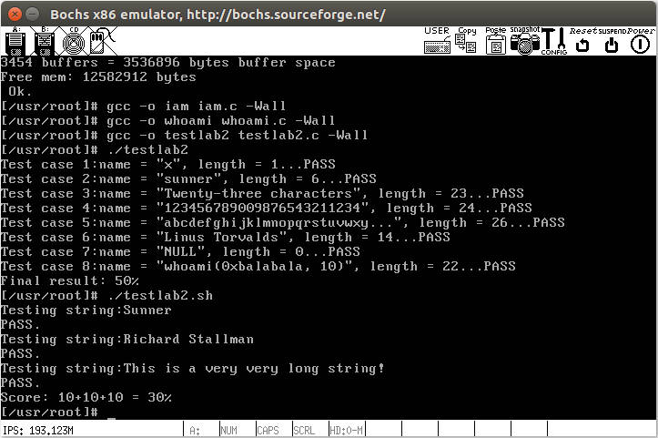

# 4 系统调用
## 4.1 实验目的
- 建立对系统调用接口的深入认识
- 掌握系统调用的基本过程
- 能完成系统调用的全面控制
- 为后续实验做准备

## 4.2 实验内容
在`Linux 0.11`上添加两个系统调用，并编写两个简单的应用程序测试它们

### 4.2.1 iam()
第一个系统调用是`iam()`，其原型为：
```
int iam(const char * name);
```
完成的功能是将字符串参数`name`的内容拷贝到内核中保存下来。 要求`name`的长度不能超过`23`个字符。返回值是拷贝的字符数。 如果`name`的字符个数超过了`23`，则返回`-1`，并置`errno`为`EINVAL`

在`kernal/who.c`中实现此系统调用。


### 4.2.2 whoami()
第二个系统调用是`whoami()`，其原型为：
```
int whoami(char* name, unsigned int size);
```
它将内核中由`iam()`保存的名字拷贝到`name`指向的用户地址空间中，同时确保不会对`name`越界访存（`name`的大小由`size`说明）。返回值是拷贝的字符数。如果`size`小于需要的空间，则返回`-1`，并置`errno`为`EINVAL`。

也是在`kernal/who.c`中实现。
### 4.2.3 测试程序
运行添加过新系统调用的`Linux 0.11`，在其环境下编写两个测试程序`iam.c`和`whoami.c`。最终的运行结果是：
```
$ ./iam guojunos
$ ./whoami
$ guojunos
```
## 4.3 实验报告
### 4.3.1 实验过程
#### 4.3.1.1 基础知识
1. 实现系统调用需要一个`API`，程序先调用`API`，`API`进入内核态后才能调用内核函数（即系统调用）
2. `lib`目录下有一些已经实现的`API`（.c文件）
3. `include`目录下是一些.h文件，其中`include/unistd.h`文件是标准头文件
4. `API`中的函数用宏表示，这些宏在`include/unistd.h`文件中被定义，所以添加新的`API`时需要修改`include/unistd.h`文件
5. <div align="center"></div><center><font size=2 color=grey>图1 系统调用过程分析</font></center>
#### 4.3.1.2 实验过程
1. `include/unistd.h`添加`iam`和`whoami`系统调用编号的宏定义
   <div align="center"></div><center><font size=2 color=grey>图2 系统调用编号宏定义</font></center>
2. 在`kernel/system_call.s`中修改系统调用总数
   <div align="center"></div><center><font size=2 color=grey>图3 系统调用总数</font></center>
3. 在`include/linux/sys.h`的函数表中增加两个函数引用
   <div align="center"></div><center><font size=2 color=grey>图4 添加函数表函数</font></center>
4. 模仿`fs/open.c/sys_close(int fd)`在`kernal/who.c`中实现`sys_iam()`和`sys_whoami()`，首先编写一个简单的系统调用用于测试
   ```c
   #include <linux/kernel.h> //调用printk

   int sys_iam(const char* name)
   {
      printk("iam\n");
      return 0;
   }

   int sys_whoami(char* pos,unsigned int size)
   {
      printk("whoami\n");
      return 0;
   }
   ```
5. 修改`kernal/Makefile`重新编译
6. 模仿`lib/close.c`编写测试应用程序`iam.c`和`whoami.c`，它们分别调用两个系统调用，对两个系统调用进行测试
   ```c
   // iam.c
   #define __LIBRARY__ //必须添加
   #include <unistd.h> //必须添加：定义了__NR_iam

   _syscall1(int,iam,const char*,name); //API，声明iam函数，call后面的数表示有几个参数

   //argc是读入参数的个数
   //argv指针数组，argv[0]是文件名字符串，之后的1、2、3就是使用者依次输入的参数
   // ./iam Zrc 相等于把后面的字符串(Zrc)作为参数读入，argv[1]表示的就是字符串(Zrc)的地址
   int main(int argc, char* argv[]) //程序
   {
      iam(argv[1]); //调用API
      return 0;
   }
   ```
   ```c
   // whoami.c
   #define __LIBRARY__
   #include <unistd.h>
   #include <stdio.h> //调用printf

   _syscall2(int, whoami, char*, name, unsigned int, size);

   int main(int argc, char* argv[])
   {
      char tempstr[24];//用户区字符地址
      whoami(tempstr,24); //调用API
      printf("%s\n",tempstr);//输出，此时位于用户层
      return 0;
   }
   ```
7. 将`iam.c`和`whoami.c`放到`bochs linux0.11`的硬盘
   <div align="center"></div><center><font size=2 color=grey>图4 文件交换</font></center>
   
   ```bash
   cd ~/oslab 
   sudo ./mount-hdc # 将hdc-0.11.img挂载到宿主机的文件系统中，此时宿主机的文件系统便可以查看和修改hdc-0.11.img中的内容
   cp /home/zuozuo/oslab/lab2/iam.c hdc/usr/root # 将iam.c复制到hdc-0.11.img中的./usr/root目录下
   cp /home/zuozuo/oslab/lab2/whoami.c hdc/usr/root
   cp /home/zuozuo/oslab/lab2/testlab2.c hdc/usr/root # 测试程序也放进去吧
   cp /home/zuozuo/oslab/lab2/testlab2.sh hdc/usr/root
   sudo umount hdc # 解除挂载
   ```
   <div align="center"></div><center><font size=2 color=grey>图5 交换结果</font></center> 
8. 在`bochs linux0.11`下编译`iam.c`并运行
   ```bash
   gcc -o iam iam.c -Wall
   ./iam zrc
   ```
9. 报错，报错原因是编译`iam.c`时，`include <unistd.h>`的是`bochs linux 0.11`中`/usr/include`目录下的`unistd.h`，而此时它没有`__NR_whoami`和`__NR_iam`两个宏，需要将宿主机中修改后的`include/unistd.h`复制到`bochs linux 0.11`硬盘中的`/usr/include`目录
   <div align="center"></div><center><font size=2 color=grey>图6 报错</font></center> 
   <div align="center"></div><center><font size=2 color=grey>图7 bochs linux 0.11中的/usr/include目录</font></center> 

   ```bash
   cd ~/oslab
   sudo ./mount-hdc
   cp /home/zuozuo/oslab/linux-0.11/include/unistd.h hdc/usr/include
   sudo umount hdc
   ```
10. 测试成功，此时只需要完善`who.c`中的`sys_iam()`和`sys_whoami()`即可完成实验
   <div align="center"></div><center><font size=2 color=grey>图8 测试结果</font></center> 

11. 通过`get_fs_byte()`(在asm/segment.h中被定义)在内核态下获取用户空间数据，参照`fs/open.c`使用它实现`sys_iam()`函数
   ```c
   #include <asm/segment.h> // 调用get_fs_byte()
   #include <errno.h> // 调用宏EINVAL
   
   char msg[24]; // 最多23个字符（结尾为\0）
   int len = 0; //字符串长度
   
   int sys_iam(const char* name)
   {
      int count = 0;
      while(get_fs_byte(name+count) != '\0') // name为字符串指针，指向用户空间下的字符串首字符的地址，使用while循环一个字符一个字符的读入
      {
         if(count >= 23) // 读入第24个字符
         {
            return -(EINVAL);
         }
         count = count + 1;
      }
      len = count;
      for(count = 0; count < len; count++)
      {
		   msg[count] = get_fs_byte(name+count);
      }
      return len;
   }
   ```
12. 通过`put_fs_byte()`(在asm/segment.h中被定义)在内核态下将内核空间数据拷贝至用户空间，使用它实现`sys_whoami()`函数
   ```c
   int sys_whoami(char* name, unsigned int size)
   {
      int i;
      if(len > size)
      {
         return -(EINVAL);
      }
      for(i=0; i<len; i++)	
      {
         put_fs_byte(msg[i], name+i);
      }
      return len;
   }
   ```
13. `include/unistd.h`中定义了系统调用嵌入式汇编宏函数(即API)，API调用了内核函数(即`sys_xxx()`)，如果内核函数的返回值小于0，则API会把errno置为返回值的相反数并返回-1。因此在内核函数中如果出错，只需要`return -(EINVAL)`即可，这样当内核函数出错时，EINVAL错误码为正数，内核函数返回-EINVAL到API中，API发现返回值为负数，便将errno置为返回值的相反数即-(-EINVAL)，并返回-1，满足实验要求
14. 运行测试程序，最终的运行结果如下
   <div align="center"></div><center><font size=2 color=grey>图9 最终运行结果</font></center> 

### 4.3.2 回答问题
在实验报告中回答如下问题：
1. **从`Linux 0.11`现在的机制看，它的系统调用最多能传递几个参数？**</br>
从`Linux 0.11`现在的机制看，它的系统调用最多只能直接传递三个参数，因为内核中只定义了`_syscall1`、`_syscall2`以及`_syscall3`三个宏。并且程序使用`ebx`、`ecx`、`edx`这三个通用寄存器来保存函数的参数，至多可以直接向系统调用传递三个参数。
1. **你能想出办法来扩大这个限制吗？**</br>
将需要传递的参数保存在有特定结构的内存空间中，并将内存空间的首地址放在寄存器中传递给系统调用，通过寄存器间接寻址方式便可以访问所有参数。
1. **用文字简要描述向`Linux 0.11`添加一个系统调用`foo()`的步骤。**
   1. 使用c语言实现系统调用函数`sys_foo()`，这个函数可以放在`kernel/sys.c`中或在 `kernel/`下新建一个`.c`文件；
   2. 在`include/linux/sys.h`中的函数指针表`sys_call_table`末端插入系统调用函数的名称`sys_foo`，并添加函数引用`extern int sys_foo()`
   3. 在`include/unistd.h`中添加新系统调用号`#define __NR_foo num`
   4. 在`kernel/system_call.s`中的`nr_system_calls = 72`的值加1，该值表示内核中的系统调用总数
   5. 修改`Makefile`，将第一步创建的`.c`文件与内核其它代码编译链接到一起