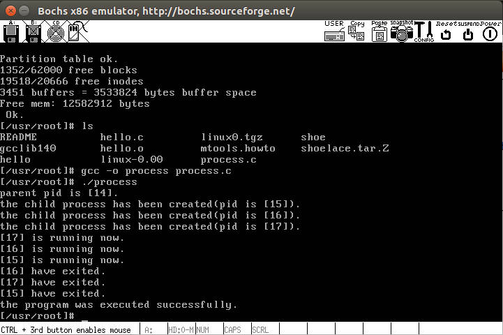
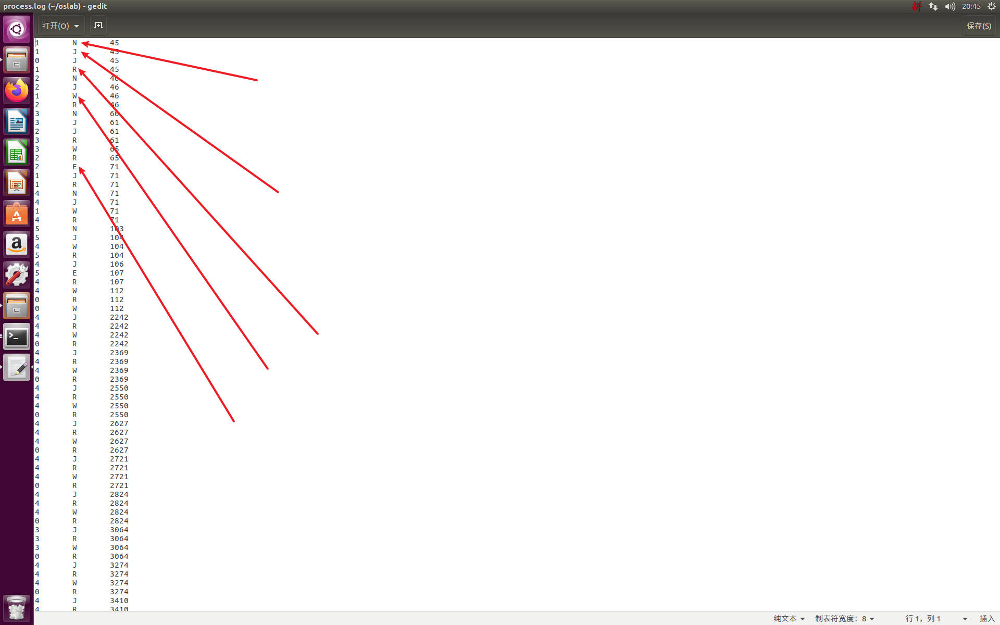
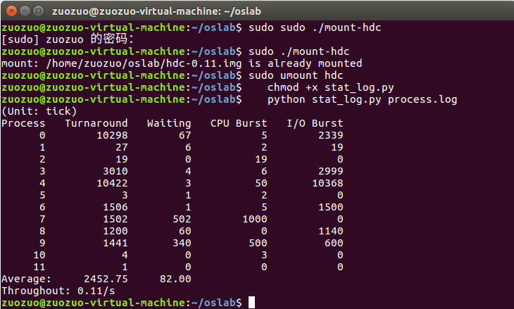
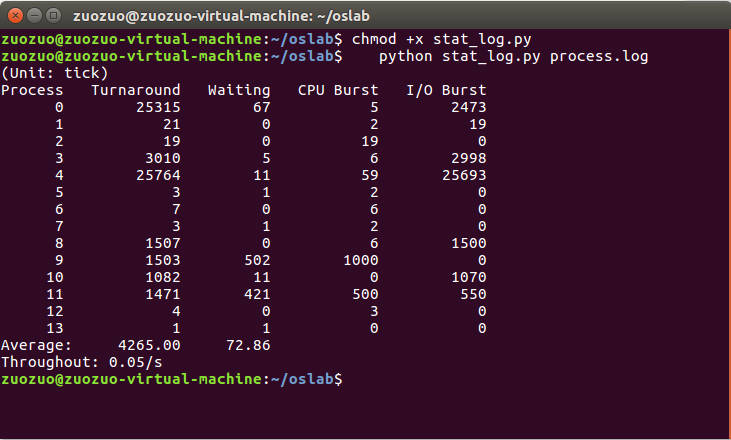
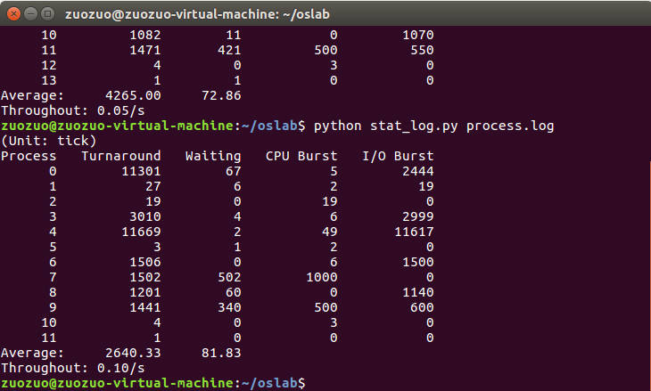

> 代码注释
> * 改写文件
>     * ./code/linux-0.11/init/main.c
>     * ./code/linux-0.11/kernel/fork.c
>     * ./code/linux-0.11/kernel/printk.c
>     * ./code/linux-0.11/kernel/sched.c
>     * ./code/linux-0.11/kernel/exit.c
>     * ./code/process.c
> * 输出文件
>     * ./code/process10.log（priority=10）
>     * ./code/process15.log（priority=15）
>     * ./code/process20.log（priority=20）

# 5 进程运行轨迹的跟踪与统计
## 5.1 实验目的
* 掌握Linux下的多进程编程技术；
* 通过对进程运行轨迹的跟踪来形象化进程的概念；
* 在进程运行轨迹跟踪的基础上进行相应的数据统计，从而能对进程调度算法进行实际的量化评价，更进一步加深对调度和调度算法的理解，获得能在实际操作系统上对调度算法进行实验数据对比的直接经验。

## 5.2 实验内容
进程从创建(Linux下调用`fork()`)到结束的整个过程就是进程的生命期，进程在其生命期中的运行轨迹实际上就表现为进程状态的多次切换，如进程创建以后会成为就绪态；当该进程被调度以后会切换到运行态；在运行的过程中如果启动了一个文件读写操作，操作系统会将该进程切换到阻塞态（等待态）从而让出CPU；当文件读写完毕以后，操作系统会在将其切换成就绪态，等待进程调度算法来调度该进程执行……

本次实验包括如下内容：
1. 基于模板`process.c`编写多进程的样本程序，实现如下功能：
   1. 所有子进程都并行运行，每个子进程的实际运行时间一般不超过 30 秒；
   2. 父进程向标准输出打印所有子进程的 id ，并在所有子进程都退出后才退出；
   ```c
   /*
   * 此函数按照参数占用CPU和I/O时间
   * last: 函数实际占用CPU和I/O的总时间，不含在就绪队列中的时间，>=0是必须的
   * cpu_time: 一次连续占用CPU的时间，>=0是必须的
   * io_time: 一次I/O消耗的时间，>=0是必须的
   * 如果last > cpu_time + io_time，则往复多次占用CPU和I/O，直到总运行时间超过last为止
   * 所有时间的单位为秒
   */
   cpuio_bound(int last, int cpu_time, int io_time);

   //比如一个进程如果要占用10秒的CPU时间，它可以调用：
   cpuio_bound(10, 1, 0);  // 只要cpu_time>0，io_time=0，效果相同


   // 以I/O为主要任务：
   cpuio_bound(10, 0, 1);  // 只要cpu_time=0，io_time>0，效果相同

   // CPU和I/O各1秒钟轮回：
   cpuio_bound(10, 1, 1);

   // 较多的I/O，较少的CPU：
   cpuio_bound(10, 1, 9);  // I/O时间是CPU时间的9倍
   ```
2. 在Linux 0.11上实现进程运行轨迹的跟踪。基本任务是在内核中维护一个日志文件`/var/process.log`，把从操作系统启动到系统关机过程中所有进程的运行轨迹都记录在这一log文件中。
3. 在修改过的0.11上运行样本程序，通过分析log文件，统计该程序建立的所有进程的等待时间、完成时间（周转时间）和运行时间，然后计算平均等待时间，平均完成时间和吞吐量。可以自己编写统计程序，也可以使用python脚本程序`stat_log.py`进行统计。
4. 修改0.11进程调度的时间片，然后再运行同样的样本程序，统计同样的时间数据，和原有的情况对比，体会不同时间片带来的差异。

`/var/process.log`文件的格式必须为：
```
pid X time
```
其中：
* pid 是进程的 ID ；
* X 可以是 N , J , R , W 和 E 中的任意一个，分别表示进程新建( N )、进入就绪态( J )、进入运行态( R )、进入阻塞态( W )和退出( E )；
* time 表示 X 发生的时间。这个时间不是物理时间，而是系统的滴答时间( tick )；

三个字段之间用制表符分隔。 例如：
```
12    N    1056
12    J    1057
4     W    1057
12    R    1057
13    N    1058
13    J    1059
14    N    1059
14    J    1060
15    N    1060
15    J    1061
12    W    1061
15    R    1061
15    J    1076
14    R    1076
14    E    1076
……
```
## 5.3 实验报告
完成实验后，在实验报告中回答如下问题：
1. 结合自己的体会，谈谈从程序设计者的角度看，单进程编程和多进程编程最大的区别是什么？
2. 你是如何修改时间片的？仅针对样本程序建立的进程，在修改时间片前后， log 文件的统计结果（不包括Graphic）都是什么样？结合你的修改分析一下为什么会这样变化，或者为什么没变化？

## 5.4 基础知识
### fork()
* `fork()`系统调用通过系统调用创建一个与原来进程几乎完全相同的进程，两个进程可以做完全相同的事
* 一个进程调用`fork()`函数后，系统先给新的进程分配资源，例如存储数据和代码的空间，然后再把原来进程的所有的值和状态都复制到新的新进程中（一般是写时复制），相当于克隆了一个自己
* 程序（进程）的本质就是状态机（通过执行代码修改电路的状态）；操作系统就是状态机的管理者，它将状态机虚拟化（将所有状态机包裹起来），一次可以选择一个状态机执行一步；`fork()`实际就是状态机的复制
* 创建新进程成功后，系统中出现两个基本完全相同的进程，这两个进程执行没有固定的先后顺序，哪个进程先执行要看系统的进程调度策略
### struct tms
* 结构体`struct tms`定义在<sys/time.h>中
   ```c
   /* Structure describing CPU time used by a process and its children.  */ 
   struct tms 
   { 
      clock_t tms_utime ;          /* User CPU time.  用户程序 CPU 时间*/ 
      clock_t tms_stime ;          /* System CPU time. 系统调用所耗费的 CPU 时间 */ 

      clock_t tms_cutime ;         /* User CPU time of dead children. 已死掉子进程的 CPU 时间*/ 
      clock_t tms_cstime ;         /* System CPU time of dead children.  已死掉子进程所耗费的系统调用 CPU 时间*/ 
   };
   ```
* 用户CPU时间和系统CPU时间之和为CPU时间，即命令占用CPU执行的时间总和
* 具体解释如下
  * tms_utime:
    * 用户CPU时间（User CPU Time）。
    * 表示进程在用户态运行的时间，即进程在执行自己的指令时所花费的时间。
  * tms_stime:
    * 系统CPU时间（System CPU Time）。
    * 表示进程在内核态运行的时间，即进程在执行系统调用等内核操作时所花费的时间。
  * tms_cutime:
    * 累计用户CPU时间（Cumulative User CPU Time）。
    * 表示进程及其所有已终止的子进程在用户态运行的总时间。
  * tms_cstime:
    * 累计系统CPU时间（Cumulative System CPU Time）。
    * 表示进程及其所有已终止的子进程在内核态运行的总时间。
### clock_t
* 变量类型`struct tms`定义为长整型数，其定义为：
   ```c
   #ifndef _CLOCK_T_DEFINED
   typedef long clock_t;
   #define _CLOCK_T_DEFINED
   #endif
   ```
### wait()
* `wait()`系统调用一般用在父进程中，用于等待子进程的终止并获取其退出状态，返回值为子进程的pid
## 5.5 实验过程
### 5.5.1 process.c的实现
1. 代码编写，实现：所有子进程并行运行，运行时间不超过30秒；父进程向标准输出打印所有子进程的id，并在所有子进程退出后才退出
   ```c
   #include <stdio.h>
   #include <unistd.h>
   #include <time.h>
   #include <sys/times.h>
   #include <sys/wait.h>

   #define HZ 100 /*每秒钟的时钟滴答次数*/

   void cpuio_bound(int last, int cpu_time, int io_time); /*函数声明*/

   int main(int argc, char * argv[])
   {
      pid_t pid_1, pid_2, pid_3; /*子进程pid*/
      int exit_pid;
      
      printf("parent pid is [%d].\n", getpid()); /*获取父进程pid*/

      pid_1 = fork(); /*子进程返回值为0，父进程返回值为子进程pid（不为0）*/
      if(pid_1 != 0) /*如果当前是父进程*/
      {
         printf("the child process has been created(pid is [%d]).\n", pid_1);
      }
      if(pid_1 == 0) /*如果当前是子进程*/
      {
         printf("[%d] is running now.\n", getpid());
         cpuio_bound(10, 1, 0);
         exit(0); /*终止进程，返回状态码0*/
      }

      pid_2 = fork();
      if(pid_2 != 0) 
      {
         printf("the child process has been created(pid is [%d]).\n", pid_2);
      }
      if(pid_2 == 0)
      {
         printf("[%d] is running now.\n", getpid());
         cpuio_bound(10, 0, 1);
         exit(0);
      }

      pid_3 = fork();
      if(pid_3 != 0) 
      {
         printf("the child process has been created(pid is [%d]).\n", pid_3);
      }
      if(pid_3 == 0)
      {
         printf("[%d] is running now.\n", getpid());
         cpuio_bound(10, 1, 1);
         exit(0);
      }


      exit_pid = wait(NULL);
      printf("[%d] have exited.\n",exit_pid);
      exit_pid = wait(NULL);
      printf("[%d] have exited.\n",exit_pid);
      exit_pid = wait(NULL);
      printf("[%d] have exited.\n",exit_pid);
      printf("the program was executed successfully.\n");

      return 0;
   }

   /*
   * 此函数按照参数占用CPU和I/O时间
   * last: 函数实际占用CPU和I/O的总时间，不含在就绪队列中的时间，>=0是必须的
   * cpu_time: 一次连续占用CPU的时间，>=0是必须的
   * io_time: 一次I/O消耗的时间，>=0是必须的
   * 如果last > cpu_time + io_time，则往复多次占用CPU和I/O
   * 所有时间的单位为秒
   */
   void cpuio_bound(int last, int cpu_time, int io_time)
   {
      struct tms start_time, current_time;
      clock_t utime, stime;
      int sleep_time;

      while (last > 0)
      {
         /* CPU Burst */

         times(&start_time); 

         do
         {
               times(&current_time); /*不断获取时钟滴答次数*/
               utime = current_time.tms_utime - start_time.tms_utime; /*代表当前进程cpuio_bound函数在用户态下运行的时钟滴答次数*/
               stime = current_time.tms_stime - start_time.tms_stime; /*代表当前进程cpuio_bound函数在内核态下运行的时钟滴答次数*/
         } while ( ( (utime + stime) / HZ )  < cpu_time );
         
         last -= cpu_time;

         if (last <= 0 ){break;}


         /* IO Burst */

         /* 用sleep(1)模拟1秒钟的I/O操作 */
         sleep_time=0;
         while (sleep_time < io_time)
         {
               sleep(1); /*系统调用，暂停1s*/
               sleep_time++;
         }
         last -= sleep_time;
      }
   }
   ```
2. 放入linux 0.11硬盘中
   ```bash
   cd ~/oslab
   sudo ./mount-hdc
   cp /home/zuozuo/oslab/process.c hdc/usr/root
   sudo umount hdc
   ```
3. 在linux 0.11下编译执行
   ```
   gcc -o process process.c -Wall
   ./process
   ```
   <div align="center"></div><center><font size=2 color=grey>图1 process执行结果</font></center> 

### 5.5.2 维护日志文件`/var/process.log`
#### 5.5.2.1 log文件的创建
1. 首先为了使`linux 0.11`在启动之后就创建`process.log`并开始记录，需要修改内核入口代码`/init/main.c`
   1. main()函数为进程0，函数中调用fork()进入进程1，并在进程1中执行init()函数
   2. init()函数创建了文件描述符0、1、2，即stdin、stdout、stderr，我们需要将log文件描述符关联到3（这是因为必须得0、1、2关联后才能打开log）
   3. 如此一来进程1之后的进程会继承0、1、2、3描述符，同时为了让log在进程0中就被创建，需要将0、1、2、3描述符的创建代码移至进程0中
      ```c
      move_to_user_mode(); /*log需要在用户模式下创建*/
      setup((void *) &drive_info);
      (void) open("/dev/tty0",O_RDWR,0);
      (void) dup(0);
      (void) dup(0);
      open("/var/process.log",O_CREAT|O_TRUNC|O_WRONLY,0666);
      if (!fork()) {		/* we count on this going ok */
		init();
      }
      ```
2. log文件将被用来记录进程的状态转移轨迹，而所有的状态转移都是在内核进行的，内核态下`write()`功能失效，和实验四中内核态不能调用`printf()`一个道理，所以需要编写在内核下可用的`write()`。函数编写参考实验教程中的`fprintk()`，注意第一个参数是文件描述符
#### 5.5.2.2 跟踪进程运行轨迹
1. `jiffies`为一个全局变量，记录了从开机到当前时间的时钟中断发生次数（滴答数），再根据定时芯片`8253`每`10ms`产生一次时钟中断，得到`jiffies`记录了从开机以来经历了多少个`10ms`
2. 寻找进程状态切换的代码点，并在这些代码点添加适当代码将进程状态变化输出到`log`文件中
   1. **新建进程**
      ```c
      /* /kernel/fork.c */

      p->start_time = jiffies; /*新建进程*/
      fprintk(3, "%ld\t%c\t%ld\n", p->pid, 'N', jiffies); /*p是一个结构体*/

      p->state = TASK_RUNNING;	/*进程就绪*/
      fprintk(3, "%ld\t%c\t%ld\n", p->pid, 'J', jiffies);
      ```
   2. **进程就绪到运行**
      ```c
      /* /kernel/sched.c */
      /* void schedule(void) */

      (*p)->state=TASK_RUNNING; /*从可中断到就绪态*/
      fprintk(3, "%ld\t%c\t%ld\n", (*p)->pid, 'J', jiffies);

      /*进程切换：如果下一个进程与当前进程不同，则将下一个进程设置为运行状态再切换*/
      if(current->pid != task[next] ->pid)
      {
         if(current->state == TASK_RUNNING)
            fprintk(3,"%ld\t%c\t%ld\n",current->pid,'J',jiffies); /*当前程序变就绪*/
         fprintk(3,"%ld\t%c\t%ld\n",task[next]->pid,'R',jiffies); /*下一程序从变运行*/
      }
      switch_to(next);
      ```
   3. **进程运行到睡眠**
      ```c
      /* /kernel/sched.c */
      /* void sleep_on(struct task_struct **p) */

      current->state = TASK_UNINTERRUPTIBLE;
      fprintk(3, "%ld\t%c\t%ld\n", current->pid, 'W', jiffies); /*进程进入睡眠（堵塞）*/

      if (tmp)
      {
         tmp->state=0; /*注意此处0就是TASK_RUNNING*/
         fprintk(3,"%ld\t%c\t%ld\n",tmp->pid,'J',jiffies);
      }
      ```
      ```c
      /* /kernel/sched.c */
      /* void interruptible_sleep_on(struct task_struct **p) */

      repeat:	current->state = TASK_INTERRUPTIBLE;
      fprintk(3, "%ld\t%c\t%ld\n", current->pid, 'W', jiffies);

      (**p).state=0;
      fprintk(3,"%ld\t%c\t%ld\n",(**p).pid,'J',jiffies);

      tmp->state=0;
      fprintk(3,"%ld\t%c\t%ld\n",tmp->pid,'J',jiffies);
      ```
      ```c
      /* /kernel/sched.c */
      /* int sys_pause(void) */
      /*若系统无任何额外的进程工作，则进程0会不断的调用sys_pause()阻塞自己，当这种情况发生时，无需向 log 记录*/
      if(current->state != TASK_INTERRUPTIBLE)
         fprintk(3,"%ld\t%c\t%ld\n",current->pid,'W',jiffies);
      current->state = TASK_INTERRUPTIBLE; 
      ```
      ```c
      /* /kernel/exit.c */
      /* int sys_waitpid(pid_t pid,unsigned long * stat_addr, int options) */

      current->state=TASK_INTERRUPTIBLE;
      fprintk(3,"%ld\t%c\t%ld\n",current->pid,'W',jiffies);
      ```
      ```c
      /* /kernel/exit.c */
      /* int do_exit(long code) */

      current->state = TASK_ZOMBIE;
      fprintk(3, "%ld\t%c\t%ld\n", current->pid, 'E', jiffies);
      ```
   4. **睡眠到就绪**
      ```c
      /* /kernel/sched.c */
      /* void wake_up(struct task_struct **p) */

      (**p).state=0;
      fprintk(3, "%ld\t%c\t%ld\n", (**p).pid, 'J', jiffies);
      ```
3. 编译后重新在`linux 0.11`中执行`process.c`，并将`process.log`拷贝至宿主机查看，注意退出`linux 0.11`前执行`sync`
   ```bash
   sudo ./mount-hdc
   cp ./hdc/var/process.log ~/oslab
   sudo umount hdc
   ```
4. 如图所示5种状态均能输出
   <div align="center"></div><center><font size=2 color=grey>图2 process.log</font></center> 
### 5.5.3 log文件分析
1. 执行如下命令计算所有进程的等待时间（Waiting）、周转时间（Turnaround）、运行时间（CPU Burst+I/O Burst），计算平均等待时间、平均周转时间和吞吐量
   ```
   chmod +x stat_log.py
   python stat_log.py process.log
   ```
   <div align="center"></div><center><font size=2 color=grey>图3 统计结果</font></center> 
### 5.5.4 时间片修改
#### 时间片介绍
1. linux0.11采用的调度算法是一种综合考虑进程优先级并能动态反馈调整时间片的轮转调度算法。 那么什么是轮转调度算法呢？它为每个进程分配一个时间段，称作它的时间片，即该进程允许运行的时间。如果在时间片结束时进程还在运行，则CPU将被剥夺并分配给另一个进程；如果进程在时间片结束前阻塞或结束，则CPU当即进行切换
2. 进程之间的切换是需要时间的，如果时间片设定得太小的话，就会发生频繁的进程切换，因此会浪费大量时间在进程切换上，影响效率；如果时间片设定得足够大的话，就不会浪费时间在进程切换上，利用率会更高，但是用户交互性会受到影响
#### 时间片修改
1. 时间片的初值为进程0的priority，在`linux-0.11/include/linux/sched.h`的宏`INIT_TASK`中定义，只需修改宏中的第三个值即可
   ```c
   #define INIT_TASK \
      { 0,15,15, //分别对应state;counter;和priority;
   ```
2. 分别将15换为10和20，得到如下结果
   <div align="center"></div><center><font size=2 color=grey>图4 priority为10</font></center> 
   <div align="center"></div><center><font size=2 color=grey>图5 priority为20</font></center> 
3. 除此之外，也可以修改新时间片的计算方式，以达到时间片修改的目的，例如将`kernel/sched.c`中的`counter >> 1`改为`counter >> 2`
   ```c
   for (p = &LAST_TASK; p > &FIRST_TASK; --p) {
      if (*p) 
      {
         (*p)->counter = ((*p)->counter >> 1) + (*p)->priority;
      }
   }
   ```
## 5.6 实验报告
1. **结合自己的体会，谈谈从程序设计者的角度看，单进程编程和多进程编程最大的区别是什么？**

   单进程编程是一个进程按照设计好的流程顺序执行，数据是同步的不涉及数据的切换保存，这导致了进程在等待`IO`时`CPU`是空闲的，`CPU`利用率很低

   多进程编程可以多个进程交替执行，是并行的（CPU高速切换着运行这多个进程），但是由于多个进程之间执行顺序无法得知，所以需要额外考虑进程之间的关系和影响，特别需要考虑切换进程时数据的保存

   具体而言从以下四个方面来进行阐述：


2. **你是如何修改时间片的？仅针对样本程序建立的进程，在修改时间片前后，log文件的统计结果（不包括Graphic）都是什么样？结合你的修改分析一下为什么会这样变化，或者为什么没变化？**
   
   我通过修改`/include/linux/sched.h`文件里的priority宏定义实现时间片的修改
   
   `log`文件的统计结果在[5.5.4节](#554-时间片修改)中，可以发现时间片增大和减小均导致了平均周转时间提高，等待时间和吞吐量减少

   分析如下
   * 增大时间片：
     * 平均周转时间增高：增大时间片可能导致每个进程在CPU上执行的时间变长，因此一个进程从就绪态到完成的时间较长，导致平均周转时间增加。
     * 等待时间增加：更长的时间片可能会导致在等待队列中的进程等待的时间更长，因为其他进程在CPU上执行的时间更长。
     * 吞吐量减少：增大时间片可能会导致系统响应变慢，因为每个进程在CPU上执行的时间更长，其他进程需要等待更长的时间。
   * 减小时间片：
     * 平均周转时间增高：减小时间片可能导致频繁的上下文切换，增加了进程切换的开销，使得平均周转时间增加。
     * 等待时间增加：较小的时间片可能导致进程更频繁地进入就绪队列，等待执行，因此等待时间可能会增加。
     * 吞吐量减少：减小时间片可能导致系统过度切换进程，增加调度开销，从而降低系统的吞吐量。

   综上所述，需设置合理的时间片，既不能过大，也不能过小