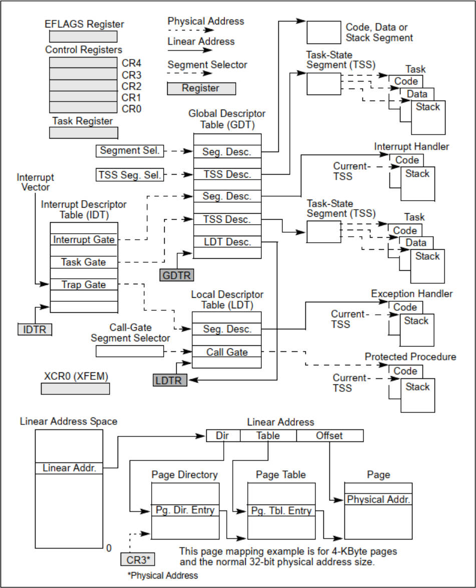
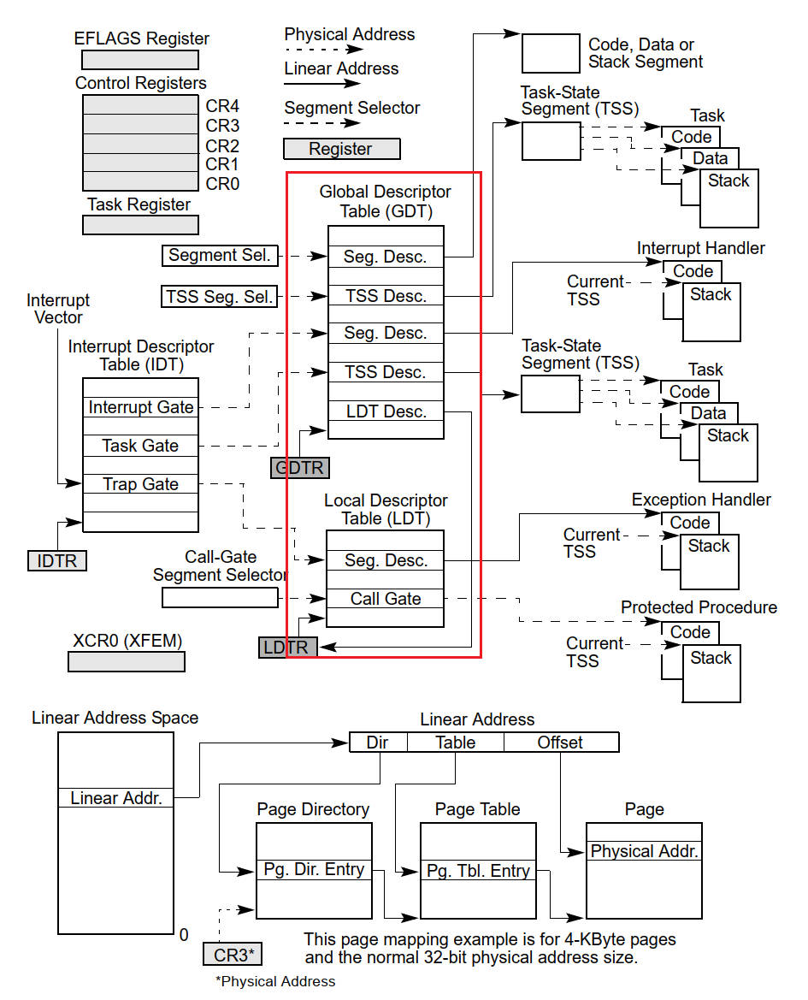
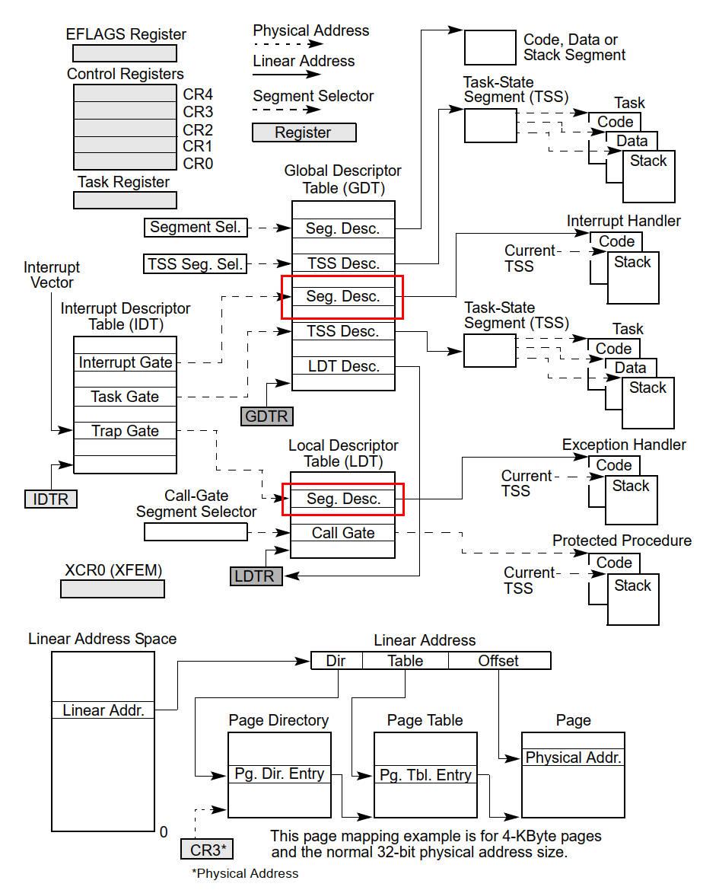
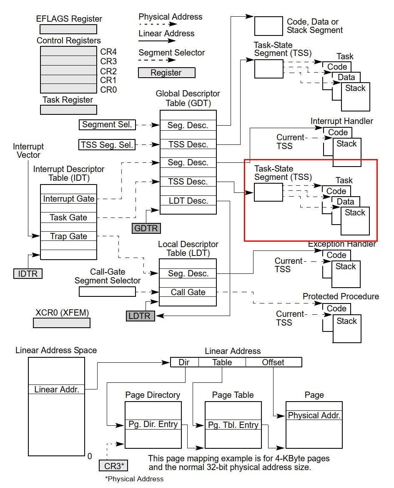
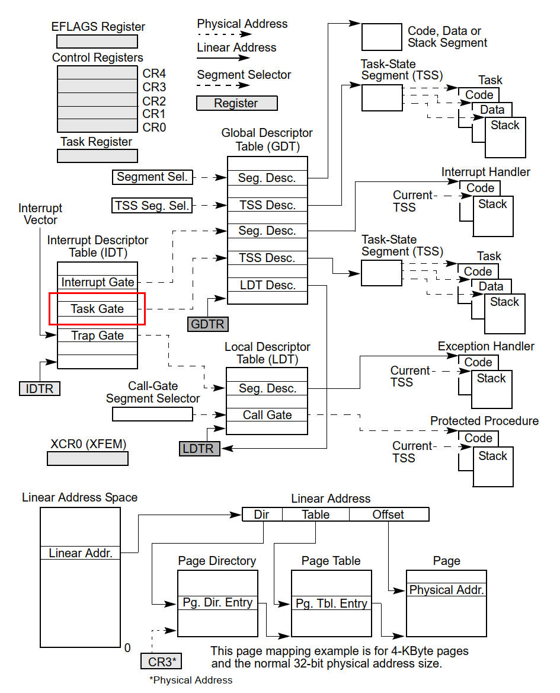
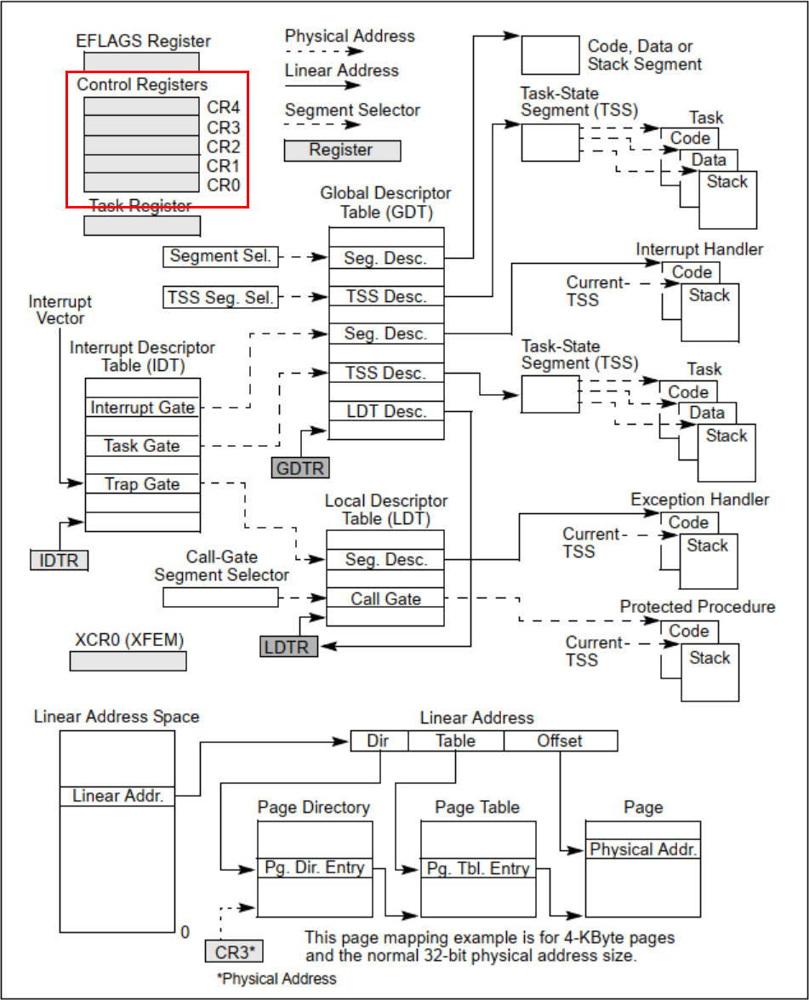
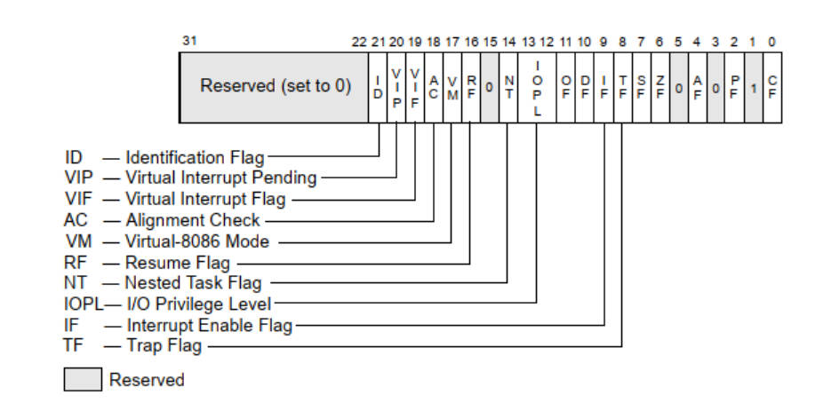
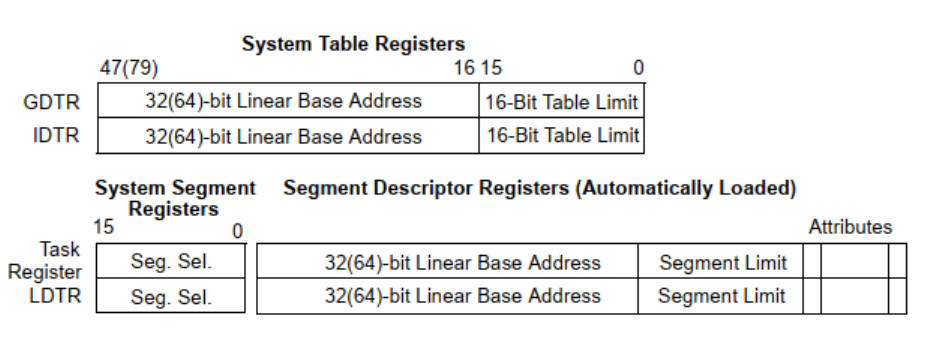
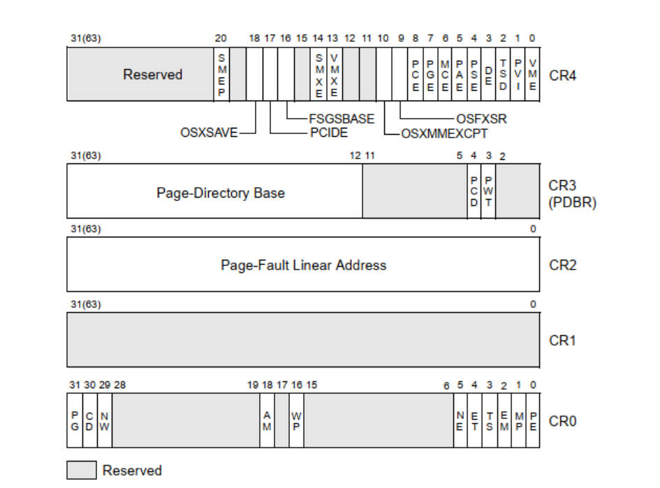

# 1 X86系统架构概览

> - **x86系统架构是一种计算机硬件架构或设计标准**，这个标准定义了一种特定类型的计算机体系结构，它包括了处理器、内存、I/O设备和与它们的互动方式等等
> - 通俗来说，X86系统架构就像是一本计算机的"操作手册"，告诉计算机制造商如何设计和组装计算机的各个部分，以便它们可以顺利地一起工作
> - 这种标准的好处是，它允许不同制造商的硬件在相同的基本规则下运行，同时也允许不同的操作系统和软件在这些计算机上运行

## 1.1 系统级体系结构概览

> - **介绍X86系统的整体构成以及不同组件如何协同工作**，为整体了解X86系统提供基础
> - x86系统高级结构主要包括处理器、内存、I/O子系统等组成部分 

图1 IA-32系统级寄存器和数据结构

### 1.1.1 Global and Local Descriptor Tables
> - 全局和局部描述符表：全局描述符表（Global Descriptor Table，GDT）和局部描述符表（Local Descriptor Table，LDT）是在x86架构中用于管理内存分段和权限的重要数据结构。它们是操作系统和硬件之间进行内存管理和保护的关键组成部分

图2 GDT和LDT

**全局描述符表（GDT）：**

- GDT是一个全局的内存描述符表，存储了系统中所有可用的[段描述符](#1)。  
- 每个段描述符包含了一个段的基地址、大小、权限信息以及其他控制段的属性。
- GDT通常由操作系统初始化，用于定义系统的内存布局和访问规则。操作系统在启动时初始化GDT，并将其基地址和界限加载到GDTR（全局描述符表寄存器）中。这样，处理器就可以使用GDT中的段描述符来访问内存。
- 每个段描述符都包含了访问权限信息，GDT的使用有助于操作系统隔离不同的应用程序和内核，提供内存保护和隔离。

**局部描述符表（LDT）：**

- LDT与GDT类似，但它是进程特定的，每个进程可以拥有自己的LDT。
- LDT允许进程在其地址空间中创建自定义的段描述符，用于实现更精细的内存管理和隔离。
- 通常，每个进程的LDT包含一个特殊的段描述符，该描述符指向该进程的LDT，储存在LDTR（局部描述符表寄存器）中。

### 1.1.2 System Segments, Segment Descriptors, and Gates

**系统段（System Segments）：**

- 系统段是用于特定系统功能和管理任务的内存段。
- 在x86架构中，有四个主要的系统段：全局描述符表（GDT）、局部描述符表（LDT）、中断描述符表（IDT）和[任务状态段（TSS）](#2)。
- GDT和LDT存储段描述符，用于内存保护和权限控制。IDT存储中断描述符，用于中断处理。TSS存储任务状态，用于任务切换。

**段描述符（Segment Descriptors）：**

图3 段描述符

- 段描述符是用于定义内存段特性和权限的数据结构。
- 每个内存段都有一个对应的段描述符，它包含了关于内存段的重要信息，如基址、段限制、权限、特权级别等。
- 段描述符存在于全局描述符表（GDT）或局部描述符表（LDT）中，并通过选择子（Selector）来引用。
- 段描述符用于控制访问内存段的方式，包括读、写、执行权限以及特权级别（Ring）。
- 操作系统使用这些描述符来实现内存保护，多任务支持和内存隔离。

**门（Gates）：**

- 门是一种数据结构，用于实现特权级别之间的转换和跳转。
- 在x86架构中，有几种不同类型的门，如中断门、陷阱门和调用门，分别用于中断处理、异常处理和进程间通信。
- 门是一种的特殊描述符，门包含了一个选择子和一个偏移量，选择子指向一个段描述符，偏移量指向执行的代码位置。
  
### 1.1.3 Task-State Segments and Task Gates

**任务状态段（Task-State Segments）：**

图4 任务状态段

- TSS是一种数据结构，用于存储处理器在任务切换时需要保存和加载的上下文信息。
- 每个任务（进程或线程）都有一个对应的TSS，其中包括了处理器寄存器状态、栈指针、特权级别和其他与任务切换相关的信息。
- TSS的主要作用是实现任务切换，当操作系统需要从一个任务切换到另一个任务时，它可以加载目标任务的TSS来保存当前任务的上下文并加载新任务的上下文。

**任务门（Task Gate）：**

图5 任务门

- 任务门是GDT中的特殊段描述符，用于在不同任务之间进行切换。任务门包含了指向TSS的偏移量（TSS段在GDT中的偏移地址）以及目标任务的特权级别信息。
- 当要执行任务切换时，处理器会使用任务门来指定目标任务。任务门包含了目标TSS的位置信息，以及要切换到的目标特权级别。处理器先跳转到任务门，并从任务门中获取目标TSS的地址，然后加载该TSS，最终实现任务切换。

### 1.1.4 Interrupt and Exception Handling
> - 中断（Interrupts）和异常（Exceptions）处理是计算机操作系统和处理器中的关键机制，用于处理外部事件、错误和异常情况

**中断（Interrupts）：**

- 中断是一种机制，允许外部设备或事件通知处理器需要处理的情况。这些事件可以包括硬件中断（如计时器中断、键盘输入）、外部设备请求、硬件故障等。
- 当中断发生时，处理器会立即停止当前执行的指令流，保存当前上下文，并跳转到与该中断相关的中断处理程序。

**异常（Exceptions）：**

- 异常是一种特殊的中断，通常指示了程序执行过程中发生的错误或异常情况。它们可能包括除零错误、页错误、非法操作码等。
- 异常处理是一种内部机制，用于捕获和处理程序的错误。当异常发生时，处理器会中断正在执行的程序并转移到异常处理程序，以便识别问题并采取适当的措施（例如终止程序或纠正错误）。

### 1.1.5 Memory Management
> - 内存管理涉及到如何分配、访问和保护系统内存
> - 内存管理同时涉及物理内存（RAM）和虚拟内存（通过磁盘上的交换文件实现）

**分段（Segmentation）：**

- x86架构使用分段来划分**内存**，将内存划分为多个段（segments）。每个段由一个段描述符（segment descriptor）定义，包括基址（base）、段限制（limit）、权限（privilege level）等信息。
- 段描述符存储在全局描述符表（Global Descriptor Table，GDT）或局部描述符表（Local Descriptor Table，LDT）中。
- 分段机制用于实现内存保护、权限控制和多任务支持。不同的段可以具有不同的权限，例如代码段和数据段可以有不同的读、写和执行权限。

**分页（Paging）：**

- 分页机制用于**虚拟内存**管理，将虚拟地址映射到物理地址。
- 分页使用页表（Page Tables）来建立虚拟地址和物理地址之间的映射关系。页表包括多级结构，允许更大范围的虚拟内存。
- 分页机制允许操作系统和应用程序在虚拟地址空间中运行，而不需要关心物理内存的详细配置。它还提供了内存隔离和保护的机制。

**虚拟内存（Virtual Memory）：**

- 虚拟内存是一种内存管理技术，将物理内存和磁盘上的虚拟内存结合使用，从而扩展了可用内存容量。
- 当物理内存不足时，虚拟内存允许系统将不活动的数据移动到磁盘上的页面文件，以释放物理内存供其他程序使用。
- 虚拟内存还支持内存映射，允许文件和设备映射到内存中，以实现更高效的文件访问和I/O操作。

**特权级别（Privilege Levels）：**

- x86架构支持四个特权级别，通常称为Ring 0到Ring 3。Ring 0拥有最高特权级别，Ring 3拥有最低特权级别。
- 特权级别控制了对系统资源的访问权限，较高特权级别可以执行特权指令，而较低特权级别受到限制。
- 操作系统内核通常在Ring 0中运行，而用户应用程序在Ring 3中运行。特权级别切换可以在进程之间实现隔离和保护。

**中断和异常处理（Interrupt and Exception Handling）：**

- x86系统支持中断和异常处理机制，用于响应外部事件、硬件中断以及程序内部错误和异常。
- 中断和异常处理程序被定义为中断描述符表（Interrupt Descriptor Table，IDT）中的入口点，当中断或异常发生时，处理器会跳转到相应的处理程序执行必要的操作。

### 1.1.6 System Registers

> - x86系统的系统寄存器（System Registers）是一组特殊的寄存器，用于控制和管理处理器的操作、系统状态和内部机制

图6 系统寄存器

- 控制寄存器（CR0,CR2,CR3和CR4）包含了一些用来控制系统级操作的标志位和数据域
- 调试寄存器允许设置断点以用于调试程序和系统软件。

## 1.2 实模式和保护模式转换

> - **介绍X86处理器的两种工作模式：实模式和保护模式**
> - 不同的应用程序需要在不同的模式下运行

### 实模式和保护模式
- **实模式**
  - 内存管理：
    - 实模式以16位模式工作，使用物理地址直接寻址内存。
    - 内存分段是基于固定大小（64KB）的段，没有虚拟内存概念，也没有内存保护机制。程序可以访问系统的任何内存区域。
  - 特权级别：
    - 实模式只有一个特权级别（Ring 0），没有明确的区分用户模式和内核模式。
    - 用户程序和内核代码没有严格的隔离，用户程序可以执行特权指令并访问系统资源。
- **保护模式**
  - 内存管理：
    - 保护模式支持32位或64位操作，提供广泛的内存寻址范围。
    - 内存分段和分页允许虚拟内存管理，内存保护和隔离，确保不同程序不会相互干扰。
  - 特权级别：
    - 保护模式引入了四个特权级别（Ring 0到Ring 3）。
    -  不同特权级别之间有严格的权限控制，只有Ring 0拥有完全的系统访问权限，Ring 3是用户模式，受到最多的限制。

### 实模式到保护模式
1. **关闭中断**：在进入保护模式之前，首先需要关闭中断，以防止中断干扰切换过程。这是通过将中断标志位(IF)清零来实现的。
2. **加载全局描述符表 (Global Descriptor Table, GDT)**：保护模式使用全局描述符表来管理内存分段。在切换到保护模式之前，需要将GDT的地址加载到GDTR寄存器中。
3. **设置控制寄存器CR0**：控制寄存器CR0的第0位（PE位）用于控制处理器的工作模式，0表示实模式，1表示保护模式。将CR0的PE位设置为1即可切换到保护模式。
4. **设置堆栈**：在实模式下，使用的是单一的堆栈段。但在保护模式下，你可以使用多个堆栈段。需要加载新的堆栈段选择子(SS)和堆栈指针寄存器(ESP)来确保堆栈操作的正确性。
5. **加载新的代码段选择子**：在保护模式下，代码段的选择子可能会改变。需要加载新的代码段选择子(CS)。
6. **启用中断**：切换到保护模式后，需要重新启用中断，以便操作系统和其他程序能够处理中断。

## 1.3 80x86系统指令寄存器

> - **介绍X86处理器中的各种寄存器**，包括通用寄存器、段寄存器和标志寄存器等
> - 寄存器是X86系统的核心组成部分，用于存储和处理数据

1. **标志寄存器 (EFLAGS)**：

图7 标志寄存器

- `EFLAGS`寄存器是一个32位寄存器，用于存储各种标志位，它们反映了处理器的状态和条件。这些标志位包括零标志(ZF)、进位标志(CF)、溢出标志(OF)、符号标志(SF)等，它们用于控制条件跳转指令和算术运算的行为。

1. **内存管理寄存器**：

图8 内存管理寄存器

- `GDTR` (Global Descriptor Table Register)：`GDTR`寄存器用于存储全局描述符表(GDT)的地址。GDT是用于管理内存分段的数据结构，它包含描述符，每个描述符定义了一个内存段的属性。
- `LDTR` (Local Descriptor Table Register)：`LDTR`寄存器用于存储本地描述符表(LDT)的地址。LDT是一个可选的表，通常不常用。它类似于GDT，但在一些特定情况下，可以用于分段。
- `IDTR` (Interrupt Descriptor Table Register)：`IDTR`寄存器用于存储中断描述符表(IDT)的地址。IDT包含了用于处理中断和异常的描述符。操作系统通常会设置IDT来处理各种中断和异常。
- `TR` (Task Register)：TR寄存器用于存储任务状态段(TSS)的选择子。

1. **控制寄存器**：

图9 控制寄存器

- `CR0` (Control Register 0)：`CR0`是一个32位的控制寄存器，其中包含了处理器的各种控制标志，例如启用分页、启用保护模式、启用协处理器等。CR0的位用于启用或禁用不同的处理器功能。
- `CR1`、`CR2`、`CR3`：在32位保护模式下，`CR1`未使用，`CR2`用于存储页故障线性地址，`CR3`用于存储页目录表的物理地址。CR3在虚拟内存管理中非常重要，它指定了页表结构的位置。

## 1.4 系统指令

> - **介绍X86处理器支持的系统级指令**，这些指令用于执行操作系统和底层系统管理任务
> - 包括了访问内存、中断处理、I/O操作等操作

| 指令| 功能描述 |
| :------: | :-----------------------: | 
| LGDT   | 加载GDT的地址到GDTR寄存器中     | 
| SGDT   | 将当前GDT的地址和大小存储到指定的内存位置   | 
| LIDT   | 加载IDT的地址到IDTR寄存器中     |
| SIDT   | 将当前IDT的地址和大小存储到指定的内存位置   |
| LLDT   | 加载LDT的选择子到LDTR寄存器中     | 
| SLDT   | 将LDT的选择子存储到指定的内存位置   | 
| LTR    | 加载TSS的选择子到TR寄存器中          | 
| STR    | 将TSS的选择子存储到指定的内存位置        |
