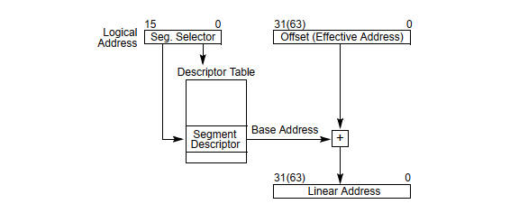
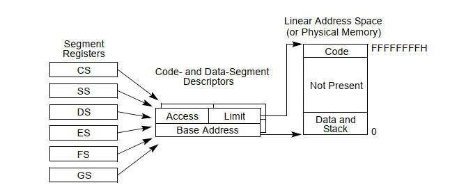
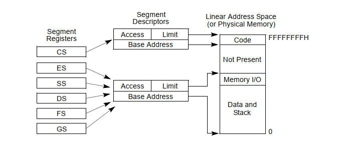
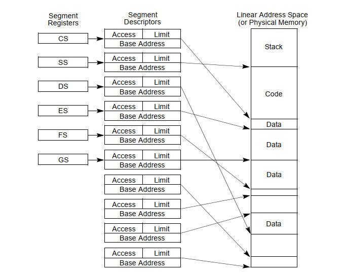
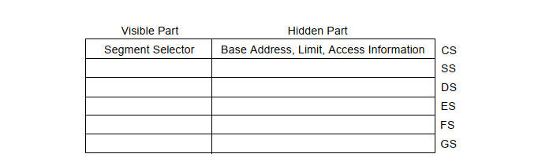
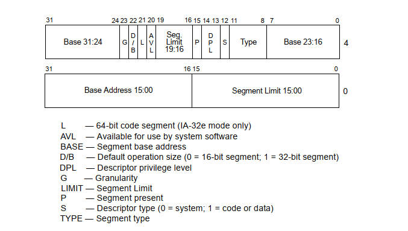

# 2 保护模式内存管理
> x86保护模式内存管理为操作系统提供了丰富的工具和机制，以有效地管理系统内存、提供虚拟内存、实现内存隔离和保护，并支持多任务操作
## 2.1 内存管理概览
内存管理可分为两部分：分段和分页：
- 分段提供了一种机制，这种机制可以为每个程序或者任务提供单独的代码、数据和栈模块，这就保证了多个进程或者任务能够在同一个处理器上运行而不互相干扰。
- 分页机制提供了虚拟内存系统，在这种系统中，程序的执行代码按需要被映射到物理内存中。分页机制同样可以用来隔离多个任务。
- 在保护模式下，分段机制是必须的，分页机制是可选的。

### 2.1.1 内存地址概念

* **逻辑地址(Logical Address)**
  * 逻辑地址又叫虚拟地址，它由应用程序或用户生成，用于访问内存中的数据或指令，应用程序直接使用的其实就是逻辑地址。
  * 逻辑地址由16位的段选择子（CS）和一个32位的偏移量段內偏移（EIP）组成，通过段选择子可以在全局符号表中选出一个段，再根据段内偏移找到相应的线性地址。
* **线性地址(Linear Address)**
  * 线性地址是位于逻辑地址和物理地址之间的中间层次地址。
  * 处理器的可寻址内存空间被称为线性地址空间，线性地址就是处理器线性地址空间中的32位地址。
  * 逻辑地址通过段选择子在描述符表中找到基地址，再将基地址与逻辑地址的段内偏移相加，便得到了线性地址。
* **物理地址(Physical Address)**
  * 物理地址是计算机内存中的实际硬件地址。这是RAM芯片上存储数据和指令的真正地址。
  * 在保护模式下，IA-32架构提供了一个4GB大小的物理地址空间，这些地址是处理器可以通过地址总线（32位）寻址到的，是平坦的（不分段），从0到FFFFFFFFH连续变化的。
  * 如果不使用分页，处理器的线性地址空间将直接映射到处理器的物理地址空间，线性地址直接映射到物理地址，没有中间层次，这意味着线性地址和物理地址是相同的。
  * 由于多任务计算系统通常会定义一个线性地址空间，这个空间比在物理内存中一次性容纳所有的空间要大得多，因此需要某种“虚拟化”线性地址空间的方法。线性地址空间的这种虚拟化是通过处理器的分页机制来处理的。

### 2.1.2 逻辑地址到线性地址（简略）
从逻辑地址到线性地址的过程如下图所示，本节对转换过程进行简略描述，详细过程可见[2.3.4节](#234-逻辑地址到线性地址)

图1 逻辑地址到线性地址

1. 逻辑地址由16位的段选择子（CS）和一个32位的偏移量段內偏移（EIP）组成
2. 通过段选择子可以在全局符号表中选出一个段
3. 根据选出的段和段内偏移找到相应的线性地址

## 2.2 分段机制
> 为什么要分段机制：分段提供了隔绝代码、数据和堆栈区域的机制，这才使得多个程序能够运行在同一个内存空间中不会相互干扰。如果 CPU 中有多个程序或者任务正在运行，那么每个程序都可以分配各自的一套段（包含程序代码、数据和堆栈），CPU 通过加强段之间的界限来达到防止应用程序相互干扰的目的

### 2.2.1 Basic Flat Model
基础平坦模型。在这个模型中，操作系统和应用程序能够使用一个连续的、未分段的地址空间。实现基础平坦模型，至少需要创建两个段描述符，一个用来描述代码段，另一个用来描述数据段。这两个段描述符在基地址和大小限制方面是相同的，都被映射到一个完整的线性地址空间，也就是说这两个段描述符有相同的基地址0（起始地址）和相同的大小限制4GB（段的长度）。

图2 Flat Model

### 2.2.2 Protected Flat Model
保护平坦模型。保护平坦模型与基础平坦模型类似，它限制段必须在真实存在的物理内存里，它还可以通过设置不同的特权等级来隔离代码和数据。

图3 Protected Flat Model

### 2.2.3 Multi-Segment Model
多段模型。多段模型中，每个程序(或任务)都有自己的段描述符和自己的段。段可以完全对其分配的程序私有，也可以在程序之间共享，获取段和程序的运行环境由硬件控制。

访问检查不仅可以用来防止引用段限制之外的地址，而且还可以防止在某些段中执行不允许的操作。

图4 Multi-Segment Model

## 2.3 逻辑地址和线性地址的转换
### 2.3.1 段选择子 Segment Selectors
> 逻辑地址的前16位为段选择子

段选择子不直接指向某一个段，而是用来标识一个段描述子。它由以下几个部分组成：
* Requested Privilege Level（第0位和第1位）：决定段选择子的权限等级，0为最高等级，3为最低等级
* TI flag（第2位）：决定描述符表是GDT还是LDT，TI=0表示GDT，TI=1表示LDT
* Index（第3位到第15位）：从GDT或LDT中8192个段描述子中选择一个。选择方法为`Index * 8 + base_address`

图5 Segment Selectors

### 2.3.2 段寄存器 Segment Registers
> 段寄存器储存段选择子，它的目的是减少地址转化的时间和编码的复杂性

处理器提供6个段寄存器，每个支持一种特定的内存引用(代码、堆栈或数据)。程序的执行至少需要代码段(CS)、数据段(DS)和堆栈段(SS)寄存器加载有效的段选择子。处理器还提供了三个额外的数据段寄存器(ES、FS和GS)，这些寄存器可用于为当前正在执行的程序(或任务)提供额外的数据段。对于要访问段的程序，段的段选择子必须已加载到某个段寄存器中。因此，尽管一个系统可以定义数千个段，但只有6个可以立即使用，其他段可以通过在程序执行期间将它们的段选择器加载到这些寄存器中来实现。加载段寄存器的两种加载指令:

* **直接加载指令**，如`MOV`、`POP`、`LDS`、`LES`、`LSS`、`LGS`和`LFS`指令。这些指令显式地引用段寄存器。

* **隐含的加载指令**，如`JMP`和`RET`指令，`SYSENTER`和`SYSEXIT`指令，`IRET`、`INTN`、`INTO`和`INT3`指令。这些指令改变CS寄存器(有时是其他段寄存器)的内容，作为其操作的附带部分。

图6 Segment Registers

### 2.3.3 段描述子 Segment Descriptors
> 段描述子是存在于GDT和LDT里面的一种数据结构，它向处理器提供的段的位置、大小以及访问控制和状态信息

* Segment limit field（段限制域）
  * 高4字节19 - 16位 + 低4字节15 - 0位
  * 确定了段的大小
* Base address fields（基地址）
  * 高4字节的31 - 24，7 - 0位 + 低4字节的31 - 16位
  * 定义段的字节0在4GByte线性地址空间中的位置。
* Type field（类型字段）
  * 高4字节的11 - 8位
  * 标识了段或者门的类型，并指定可以对段进行的访问的类型和段的增长方向。
* S(describe type) flag（S(描述符类型)标志）
  * 高4字节的12位
  * 决定段的类型，S = 0标识系统段，S = 1标识代码或数据段。
* DPL(descriptor privilege level) field（描述符特权级别）
  * 高4字节的14 - 13位
  * 确定段的特权等级，被用来进行段的访问控制。
* P(segment-present) flag（段存在位）
  * 高4字节的15位
  * 标识了段是否存在与内存中，如果将其设置为0，则表示这个段描述符是无效的。
* D/B (default operation size/default stack pointer size and/or upper bound) flag（D/B(默认操作大小/默认堆栈指针大小和/或上限)标志 ）
  * 高4字节的22位
  * 根据段描述符是可执行代码段、展开数据段还是堆栈段来执行不同的功能

图7 Segment Descriptors

### 2.3.4 逻辑地址到线性地址
逻辑地址通常由一个段选择器和一个偏移量组成。段选择器是一个索引，用于在全局描述符表（Global Descriptor Table，GDT）或局部描述符表（Local Descriptor Table，LDT）中查找相应的段描述符。偏移量是相对于该段的起始地址的偏移值。
1. 查找段描述符：处理器使用段选择器来访问描述符表（GDT或LDT），查找与之关联的段描述符。这个描述符包含了段的属性，包括基地址、大小、访问权限、特权级别等信息。
2. 段基址与偏移量组合：处理器将段描述符中的基地址与逻辑地址中的偏移量相加，以计算出线性地址。这是逻辑地址转换为线性地址的关键步骤，它将逻辑地址转化为在整个线性地址空间中的绝对地址。
3. 检查段存在标志：在进行地址转换后，处理器还会检查段描述符中的存在标志（P标志）是否设置为1，以确保转换后的线性地址对应的段存在。如果P标志为0，表示段不存在，操作将引发异常。
4. 检查访问权限和特权级别：处理器还会检查访问权限和特权级别，以确定是否允许访问转换后的线性地址。如果访问权限不符合要求，或者特权级别不足以访问该段，操作将被拒绝，并引发异常。
5. 线性地址的生成：如果通过了上述检查，处理器将生成有效的线性地址，该地址可用于访问内存。线性地址将用于实际的内存操作，如读取或写入数据。

## 2.4. 描述符的分类
* **数据段描述符（Data Segment Descriptor）：**
  * 数据段描述符用于定义内存中的数据段，其中存储着程序的数据。
  * 包含了数据段的属性，如基址、大小、访问权限等信息。
* **代码段描述符（Code Segment Descriptor）：**
  * 代码段描述符用于定义内存中的代码段，其中存储着程序的可执行代码。
  * 包含了代码段的属性，如基址、大小、访问权限等信息。
* **局部描述符表描述符（Local Descriptor-Table (LDT) Segment Descriptor）：**
  * 局部描述符表描述符用于定义局部描述符表，允许每个任务或进程具有自己的局部描述符表。
  * 它允许不同的任务或进程拥有独立的内存段定义，以提供额外的隔离和安全性。
* **任务状态段描述符（Task-State Segment (TSS) Descriptor）：**
  * 任务状态段描述符用于定义任务状态段，它包含了与任务切换和处理器状态相关的信息。
  * TSS描述符用于多任务操作系统中，允许处理器在不同的任务之间进行快速切换。
* **调用门描述符（Call-Gate Descriptor）：**
  * 调用门描述符用于支持过程（函数）之间的跳转和调用。
  * 它允许程序在不同的特权级别之间进行跳转和调用，提供了一种安全的方式来执行代码。
* **中断门描述符（Interrupt-Gate Descriptor）：**
  * 中断门描述符用于定义中断门，允许处理器在响应中断时跳转到指定的中断服务程序。
  * 中断门描述符包含了中断服务程序的地址和特权级别等信息。
* **陷阱门描述符（Trap-Gate Descriptor）：**
  * 陷阱门描述符与中断门描述符类似，但用于定义陷阱门，用于捕获和处理陷阱（异常）。
  * 与中断不同，陷阱不会中断当前程序的执行，而是在当前程序执行后再执行陷阱服务程序。
* **任务门描述符（Task-Gate Descriptor）：**
  * 任务门描述符用于定义任务门，允许程序跳转到特定任务的TSS。
  * 任务门描述符通常用于实现任务切换和多任务操作系统的功能。