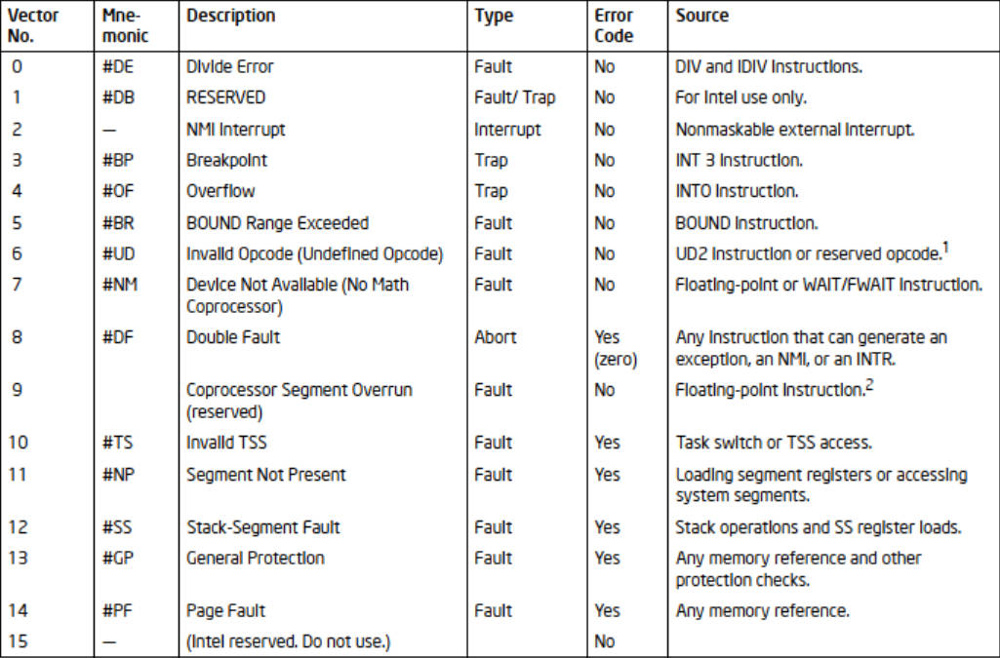
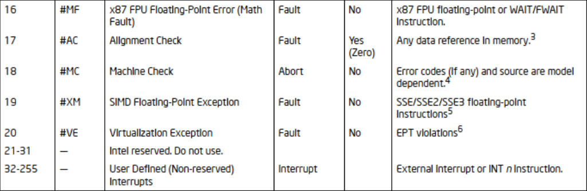
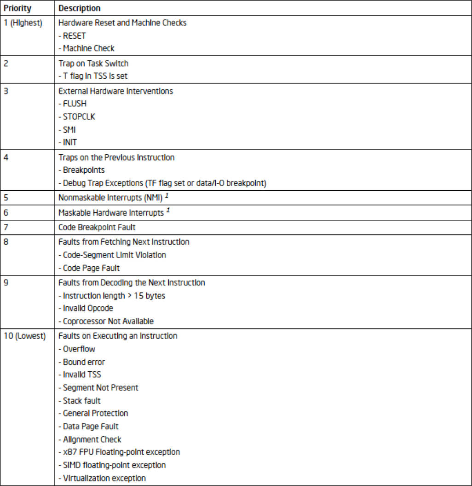
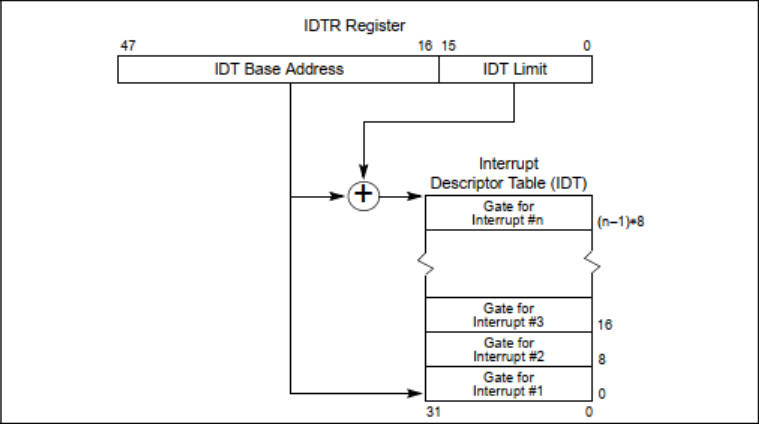
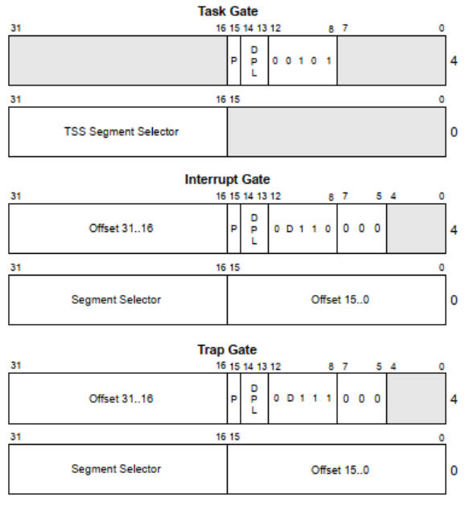

# 3 中断和异常处理
## 3.1 中断和异常处理概述
>中断和异常是计算机系统中的事件，需要引起处理器的关注，通常导致执行从当前程序或任务转移到特殊的处理程序，这些处理程序被称为中断处理程序或异常处理程序，它们执行特定的操作来处理中断或异常，并确保系统的可靠性和可控性。处理器对中断和异常的响应被称为服务或处理中断和异常。
### 3.1.1 处理器如何处理中断和异常
处理器在遇到中断或异常时，最近正在运行的程序将被暂时挂起，随后会按照相应的中断向量从中断描述符表（IDT）中找到相应的中断或异常处理程序的地址，并跳转到这个地址开始执行。当处理程序完成之后，处理器就会回复被挂起的程序。
### 3.1.2 实模式和保护模式下，中断向量表是否一样
不一样。在实模式下，使用中断向量表（IVT）；而在保护模式下，使用中断描述符表（IDT）来存储中断和异常处理程序的信息。IDT提供了更灵活的中断和异常处理方式。

# 3.2 有关中断和异常了解性的内容
## 3.2.1 中断和异常向量
中断和异常向量是用于唯一标识不同中断和异常类型的编号，它们与中断描述符表（IDT）相关联。具体来说，每一个架构级定义的，需要处理器来特殊处理的中断或异常都被分配了一个独一无二的号码，称之为中断向量。处理器就用这个向量号在中断描述符符号表（IDT） 中找到中断异常处理函数的入口来执行相应的处理程序。其中向量号0-255是架构中允许使用的号码范围：0-31是保留给IA-32系统，用作架构级定义的中断异常的标识；而32-155是留给用户，可被用户定义的向量号。

图1 保护模式中段和异常1

图2 保护模式中段和异常2

## 3.2.2 中断源和异常源
中断通常由硬件设备引发，而异常是由指令执行引发。
### 3.2.2.1 中断源
* 中断源通常是外部的或来自硬件设备的事件。
* 这些事件是异步的，可能包括硬件中断，如键盘输入、鼠标移动、网络数据包到达、计时器触发等。
* 中断源的触发通常由外部硬件设备生成信号，并要求处理器响应，以便及时处理这些事件。
### 3.2.2.2 异常源
* 异常源通常是由程序执行期间的错误或非正常情况引起的事件。
* 这些事件是同步的，通常涉及到程序执行中的错误，如除零错误、非法指令、内存访问越界、非法操作码等。
* 异常源的触发是由处理器内部的逻辑监测程序执行期间的不正常情况引起的，通常用于确保程序的稳定性和安全性。
## 3.2.3 异常的分类：故障、陷阱和中止
> 异常可以分为故障（Faults）、陷阱（Traps）和中止（Aborts）三种类型，故障通常是可恢复的，而陷阱和中止通常是不可恢复的。
* **故障**：故障一般都可以得到修正，而且一旦得到修正就可以重启程序并且保持程序的连贯性。报告故障时，处理器会恢复到故障指令之前的状态，故障处理程序会返回到故障指令所在位置，而不是故障指令后面。
* **陷阱**：陷阱一经发现就立刻报告并进行处理。陷阱允许当前程序或者任务继续执行，处理结束后返回到捕获陷阱指令之后的指令，继续执行。
* **中止**：中止一般会报告一个十分严重的错误，例如硬件错误。他通常不会报告异常出现的具体位置，一般也不会重启中断的任务或程序。
## 3.2.4 程序或任务的重新执行
* 对于故障，返回位置指向故障所在指令行，返回值指针在处理器生成异常的时候保存。因此，在程序或任务经过异常处理之后，会重新再执行一遍故障指令。
* 对于陷阱，返回位置在陷阱的后面，但是如果在跳转指令期间检测到陷阱，则会跳转到跳转指令指向的应当跳转过去的指令，而不是跳转指令的后一句。
* 对于中止，一般来讲，不支持从中止中重新启动或者返回程序任务中。
## 3.2.5 开启和禁止中断
处理器提供指令来允许或禁止中断，取决于处理器状态和`EFLAGS`寄存器中`IF`、`RF`标志
1. 开启中断：使用`STI`（Set Interrupt Flag）指令可以开启中断。这会设置处理器的中断标志位（IF）为1，允许中断。
2. 禁止中断：使用`CLI`（Clear Interrupt Flag）指令可以禁止中断。这会将中断标志位（IF）设置为0，阻止中断。
## 3.2.6 异常和中断的优先级
不同中断和异常有不同的优先级，这可以通过中断描述符表中的门描述符来控制。如果一个指令边界上有多个异常和中断被挂起，处理器将按照可预测的顺序为它们提供服务。

图3 同时异常和中断的优先级

## 3.3 中断描述符表
### 3.3.1 如何构成？
中断描述符表（IDT）是一种数据结构，包含了中断和异常处理程序的地址以及其他相关信息。中断描述符表（IDT）将每个异常或中断向量与用于处理相关异常或中断的门描述符相关联。与全局描述符表（GDT）和局部描述符表（LDT）一样，IDT 是一个 8 字节的描述符数组，在保护模式下使用。
### 3.3.2 如何获得中断处理程序的地址？
1. 访问中断描述符表（IDT）
2. 选择中断向量：每个中断或异常都与一个唯一的中断向量相关联，用于在IDT中查找门描述符。
3. 查找门描述符：在IDT中查找与所选择的中断向量号相关联的门描述符。IDT是一个表，可以使用中断向量号来索引到相应的门描述符。
4. 解析门描述符：门描述符包含有关中断或异常处理程序的地址、特权级别、段选择子等信息。获取门描述符中的地址字段，这个字段指定了中断或异常处理程序的线性地址。
4. 执行中断处理程序
### 3.3.3 如何设置中断描述符表寄存器？
`IDT`可以驻留在线性地址空间中的任何位置。处理器通过`IDTR`(中断描述符表寄存器)定位`IDT`。该寄存器为`IDT`保存32位基址和16位限制。

图4 IDTR（中断描述符表寄存器）和 IDT（中断描述符表）的关系

## 3.4 IDT 描述符
1. 中断门：中断门描述符用于处理中断，允许中断嵌套。当处理中断时，会禁用其他中断。
2. 陷阱门：陷阱门描述符用于处理陷阱，允许陷阱嵌套。与中断不同，它不会禁用其他中断。
3. 任务门：任务门描述符用于进行任务切换，例如在多任务操作系统中。任务门描述符会引发任务切换。

图5 IDT门描述符

* DPL：中段描述符权限等级
* Offset：偏移量
* P：P标志位
* Selector：目标代码段的段选择子
* D：粒度，1 = 32bits、0 = 16bits
* 阴影部分为保留位。
## 3.5 中断与异常处理
### 3.5.1 中断过程调用的流程
1. 中断或异常触发： 中断或异常通常是由外部事件、硬件设备或程序执行中的错误或特殊情况引发的。处理器检测到这些事件并确定其类型。
2. 中断向量查找： 处理器使用中断向量作为索引，查找与中断或异常相关的IDT中的门描述符。这个中断向量用于标识中断或异常的类型。
3. 门描述符类型检查： 处理器检查门描述符的类型，确定是中断门（Interrupt Gate）还是陷阱门（Trap Gate）。不同的类型会影响中断处理的方式。
4. 特权级别检查： 处理器检查门描述符中的特权级别（DPL，Descriptor Privilege Level），以确定中断处理程序的特权级别和是否需要特权级别切换。
5. 当前状态保存： 处理器会自动保存当前程序的状态，包括寄存器值、程序计数器（PC）、标志寄存器（FLAGS）等。这是为了确保在处理完中断后能够还原到原来的状态。
6. 中断处理程序执行： 如果门描述符是中断门或陷阱门，处理器将跳转到描述符中指定的中断处理程序的地址。处理程序开始执行特定的操作，以处理中断或异常，这可能包括错误报告、中断服务例程、异常处理例程等。
7. 中断或异常处理程序执行完毕： 一旦中断或异常处理程序执行完毕，处理器会根据处理程序的返回地址将控制返回到中断点，恢复先前保存的状态。
8. 恢复状态： 处理器会恢复之前保存的状态，包括寄存器值和程序计数器，以便程序可以无缝继续执行。
9. 中断屏蔽恢复： 如果中断处理程序在执行期间禁用了中断，处理器会将中断屏蔽位（中断标志位，IF）恢复为原来的状态，以允许中断再次响应。

### 3.5.2 如何判断中断处理过程与被中断任务的优先级？
通过中断描述符表中的门描述符来确定中断的优先级
### 3.5.3 不同优先级上，处理方式一样吗？
不同优先级的中断或异常可以有不同的处理方式，取决于门描述符的设置
### 3.5.4 如果发生堆栈切换，处理器会做哪些操作？
当处理器执行对异常或中断处理程序过程的调用时，如果处理程序过程将在较低的数字权限级别上执行，则会发生堆栈交换。当发生堆栈切换时：
1. 处理程序要使用的堆栈的段选择器和堆栈指针从当前执行的任务的TSS中获得。在这个新的堆栈上，处理器推送被中断过程的堆栈段选择器和堆栈指针
2. 处理器然后保存EFLAGS, CS和EIP寄存器在新堆栈上的当前状态
3. 如果异常导致错误码被保存，则将错误码压入EIP值之后的新堆栈。
### 3.5.5 如果没发生堆栈切换，处理器会做哪些操作？
如果处理程序过程将以与被中断过程相同的特权级别执行：
1. 处理器将EFLAGS、CS和EIP寄存器的当前状态保存在当前堆栈上。
2. 如果由于异常导致错误码被保存，则该错误码被压入当前堆栈的EIP值之后。
### 3.5.6 中断处理过程后，如何返回，处理器做了哪些操作？
要从异常处理程序或中断处理程序返回，处理器必须让处理程序使用`IRET`(或`IRETD`)指令。`IRET`指令与`RET`指令相似，只是它将保存的标志恢复到`EFLAGS`寄存器中。只有当`CPL`为0时，`EFLAGS`寄存器的`IOPL`字段才会恢复。只有当`CPL`小于或等于`IOPL`时，`IF`标志才会改变。
### 3.5.7 异常和中断处理过程的保护
异常处理程序和中断处理程序的特权级保护类似于通过调用门调用的普通过程调用。处理器不允许在特权比CPL低的代码段中将执行转移到异常处理程序或中断处理程序。
### 3.5.8 异常和中断处理过程的标志使用方式
当通过中断门或陷阱门访问异常或中断处理程序时，处理器在将EFLAGS寄存器的内容保存在堆栈上之后清除EFLAGS寄存器中的TF标志。(在调用异常和中断处理程序时，处理器还清除EFLAGS寄存器中的VM、RF和NT标志，然后将它们保存在堆栈上)。清除TF标志可以防止指令跟踪影响中断响应。随后的IRET指令将TF（Trace Flag）、VM（Virtual Mode Flag）、RF（Resume Flag）和 NT（Nested Task Flag）等标志位恢复为在异常或中断处理程序开始执行前在堆栈上保存的 EFLAGS 寄存器的值。
### 3.5.9 中断门与陷阱门的唯一区别是什么？
中断门和陷阱门之间的唯一区别是处理器在EFLAGS寄存器中处理IF标志的方式不同。当通过中断门访问异常或中断处理过程时，处理器清除IF标志以防止其他中断干扰当前中断处理程序。随后的IRET指令将IF标志恢复为堆栈上EFLAGS寄存器中保存的内容中的值。而通过陷阱门访问处理程序过程则不会影响IF标志。