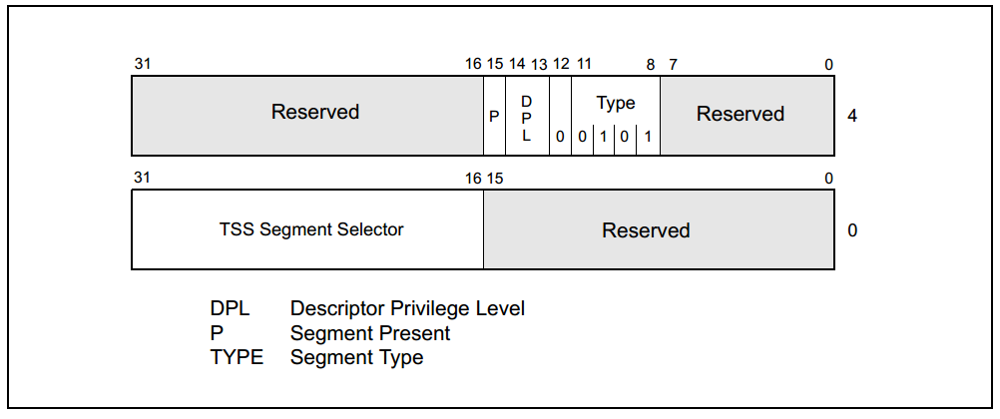

# 4 任务管理

## 4.1 任务管理概述

#### 什么是任务？

任务是在x86体系结构下执行的独立程序实体，包括代码、数据和执行状态。80x86提供了多任务支持和硬件机制，允许多个任务在不同特权级之间切换执行

#### `80x86` 提供了哪些硬件支持？
> * 段是内存的一个单位。在x86体系结构中，内存被划分为多个段，每个段都有不同的属性和用途。每个段可以包含一定范围的内存地址。这种划分内存的方式被称为分段内存管理。
> * 每个段都由一个段描述符来定义，该描述符包括了段的起始地址、大小、特权级别、访问权限等属性。不同的段可以用于存储代码、数据、堆栈以及其他类型的信息。段描述符存储在全局描述符表（Global Descriptor Table，GDT）或局部描述符表（Local Descriptor Table，LDT）中。
> * 选择子是描述符的引用，描述符描述了内存段的属性

80x86提供了硬件支持来实现任务管理，用于保存任务状态、分派任务以供执行，以及从一个任务切换到另一个任务。包括：

* 任务状态段（TSS）：用于保存任务执行状态（TSS是一个数据结构，用于存储任务的执行状态信息，包括通用寄存器、代码段、数据段、栈段、EFLAGS、控制寄存器CR3等；x86中内存被划分为多个段）。
* 任务门描述符：用于定义任务切换的入口点（任务门描述符是一种特殊的描述符，包含了指向任务状态段（Task-State Segment，TSS）或其他任务门的选择子以及任务切换时的特权级别变化）。
* 任务寄存器（TR）：用于定位当前任务的TSS。
* 局部描述符表（LDT）：存储任务所用到的段描述符（段描述符是描述内存段的一种描述符。每个内存段都由一个段描述符定义，包括了段的起始地址、大小、特权级别、访问权限等属性）。

#### 描述符表中与任务相关的描述符有哪些？

与任务相关的描述符主要包括任务状态段描述符、任务门描述符、局部描述符表描述符。这些描述符提供了操作系统进行任务切换和管理的必要信息。
* 任务状态段描述符（Task State Segment Descriptor）：指定任务状态段`TSS`的位置，`TSS`中存储了任务的运行状态，包括任务的寄存器状态、代码段和数据段选择子等信息。
* 任务门描述符（Task Gate Descriptor）：定义任务切换入口。
* 局部描述符表描述符（Local Descriptor Table Descriptor）：指定任务的局部描述符表`LDT`的位置。局部描述符表（LDT）是每个任务独有的，它存储了任务所用到的段描述符，包括代码段和数据段等
   

#### 任务切换与过程调用的区别是什么？
* 任务切换是操作系统在不同任务之间进行切换的过程。当一个任务需要暂停执行时，操作系统会将该任务的上下文信息保存到`TSS`（`Task State Segment`）中，然后选择另一个任务进行执行。任务切换可以在不同的进程之间进行，也可以在同一进程内的不同线程之间进行。任务切换需要保持和恢复任务的上下文信息，包括寄存器、程序计数器、程序状态字等，因此开销比较大。
* ​过程调用是在一个程序中调用另一个过程的过程。过程调用是通过将当前的程序状态压入栈中，然后跳转到被调用过程的入口地址开始执行的。被调用的过程执行完毕后，会将栈中保存的程序状态弹出，然后返回到原来的程序继续执行。过程调用只涉及一个程序内的上下文切换，不需要保存和恢复任务的上下文信息，因此开销比较小。

### 4.1.1 任务的结构

#### 一个任务由几部分构成？
任务由两部分构成：任务执行空间（操作系统为每个任务（进程或线程）分配的独立内存空间）和任务状态段(`task-state segment, TSS`)。 

#### 任务执行空间包括什么？
任务执行空间由代码段、堆栈段和一个或多个数据段组成

图1 任务

#### 为什么会有多个特权级栈空间？

多个特权级栈空间用于存储不同特权级任务的堆栈信息，以便隔离不同特权级的任务。
### 4.1.2 任务状态

#### 当前正在执行的任务状态包括哪些内容？

当前任务的状态包括通用寄存器的值、代码段和数据段选择子、堆栈指针等。这些信息用于描述任务的执行状态。

#### 掌握每一个被包含内容的含义？

* 任务执行空间：描述任务的代码、数据和堆栈段。
* 通用寄存器：存储任务的数据和状态。
* 任务状态寄存器（EFLAGS）：包括各种标志位，如进位标志、零标志等。
* 指令指针（EIP）：指向任务当前执行的下一条指令。
* 控制寄存器CR3：存储页表基地址。
* 任务寄存器TR：包含任务状态段`TSS`的选择子。
* 局部描述符表寄存器LDTR：包含局部描述符表的选择子。
* I/O映射和栈指针：控制任务对I/O端口的访问以及特权级栈的指针。
* 任务链：链接到之前执行的任务，用于任务切换。

#### 为什么要包含这些内容？

这些内容用于完整描述任务的执行状态，以便在任务切换时能够恢复任务的上下文，确保切换的正确执行。

### 4.1.3 任务的执行

#### 任务的执行方式有几种？

任务可以通过以下方式执行：

* 使用`CALL`或`JMP`指令显式调用或跳转到任务。
* 处理器对中断或异常处理任务的隐式调用。
* 中断或异常处理程序返回时，隐式切换回之前的任务。

#### 熟悉掌握每一种执行方式的过程

每种执行方式都涉及使用任务门或任务TSS的段选择子来标识要执行的任务。任务切换时，当前任务的上下文被保存，然后加载新任务的上下文。

#### `Linux 0.00` 用的是哪种方式？
Linux 0.00使用的是处理器对中断处理任务的隐式调用方式。中断触发任务切换，允许多任务并发执行。

#### 任务可以递归调用吗？为什么？

任务不能递归调用。在IA-32架构中，任务切换机制不支持任务调用自身或产生无限递归。任务切换会保存和恢复任务的上下文，递归调用会导致任务切换的深度无限增加，最终耗尽系统资源。为避免这种情况，递归调用通常会导致系统失败或堆栈溢出。

## 4.2 任务的数据结构

在保护模式下运行时，必须至少为一个任务创建`TSS`和`TSS`描述符，并且必须将`TSS`的段选择器加载到任务寄存器中(使用`LTR`指令)。

### 4.2.1 任务状态段 `Task-State Segment (TSS)`

图2 TSS

* 任务状态段（TSS）是一个系统段，用于保存任务执行期间的处理器状态信息，如寄存器状态和控制信息。
* TSS包括两主要部分：动态字段和静态字段。动态字段在任务切换时由处理器自动更新，包括通用寄存器状态、段选择器状态、EFLAGS寄存器状态、EIP（指令指针）状态以及前一个任务的链接字段。
* 静态字段在任务创建时设置，包括LDT分段选择器、CR3控制寄存器字段、特权级别0、1和2的堆栈指针字段、T标志（调试标志）、I/O映射基地址字段等。

### 4.2.2 `TSS` 描述符

* TSS描述符是一种段描述符，用于描述TSS的属性和位置。TSS描述符定义了TSS在全局描述符表（GDT）中的位置。
* TSS描述符包含TSS的起始地址、段限制、DPL（特权级别）、类型字段等信息。
* TSS描述符通常存储在GDT中，用于允许任务切换。
* 

图3 TSS 描述符

### 4.2.3 任务寄存器

* 任务寄存器（TR）是一个特殊的16位寄存器，其中包含了指向当前任务的TSS的段选择器。
* TR寄存器由处理器自动维护，它允许随时访问当前任务的TSS。
* TR寄存器的可见部分包含了TSS的段选择器，不可见部分用于缓存TSS的段描述符。

图4 任务寄存器

### 4.2.4 任务门描述符 `Task-Gate Descriptor`

* 任务门描述符是一种描述符，用于提供对任务的间接引用。任务门描述符可以存储在GDT、LDT或IDT中。
* 任务门描述符中的TSS段选择器字段指向GDT中的TSS描述符。任务门的段选择器中的RPL（请求特权级别）字段未被使用。
* 任务门描述符的DPL字段控制对任务的访问权限，确保只有满足特定要求的代码可以通过任务门调用或跳转到任务。

图5 任务门描述符

### 4.2.5 关系和作用:

* TSS描述符指定了TSS的位置和属性，而TR寄存器包含了指向当前任务的TSS的段选择器。任务切换时，TR寄存器的内容会被更新，以指向新任务的TSS。
* 任务门描述符提供了对任务的间接引用，它可以包含在LDT中，允许不同特权级别的程序访问相同任务。任务门描述符的DPL字段用于控制对任务的访问权限，确保只有满足特定要求的代码可以通过任务门调用或跳转到任务。
* TSS保存任务的状态信息，TR寄存器用于引用TSS，而任务门描述符用于调用或跳转到任务。这些组件一起构成了任务管理的基础，允许处理器进行任务切换和多任务处理。
  

图6 关系图

## 4.3 任务切换

### 4.3.1 什么时候发生任务切换

1. 当一个程序、任务或过程执行JMP或CALL指令，其中目标是GDT中的TSS描述符。
2. 当一个程序、任务或过程执行JMP或CALL指令，其中目标是GDT或当前LDT中的任务门描述符。
3. 当中断或异常的向量指向IDT中的任务门描述符。
4. 当当前任务在IRET指令中设置EFLAGS寄存器中的NT（Nested Task）标志，然后执行IRET指令。

### 4.3.2 发生任务切换时，处理器会执行哪些操作？
当发生任务切换时，处理器会执行以下一系列操作：

1. 获取新任务的TSS段选择器，通常作为JMP或CALL指令的操作数，来自任务门或前一个任务的链接字段（对于使用IRET指令启动的任务切换）。
2. 检查当前任务是否有权限切换到新任务。权限由段选择器的CPL和目标TSS描述符或任务门的RPL字段决定。任务门或TSS描述符的DPL字段控制访问权限。
3. 检查新任务的TSS描述符是否有效且存在，同时满足一定的限制。
4. 检查新任务是否可用（对于IRET返回的情况，任务是繁忙的）。
5. 检查当前任务、新任务以及任务切换所使用的所有段描述符是否分页到系统内存。
6. 如果任务切换是由JMP或IRET指令启动的，清除旧任务TSS描述符中的busy（B）标志。如果是由CALL指令、异常或中断启动的，则保留B标志。
7. 如果任务切换是由IRET指令启动的，清除EFLAGS寄存器的NT标志。如果是由CALL或JMP指令、异常或中断启动的，则保留NT标志。
8. 加载新任务的TSS段选择器到任务寄存器TR中。
9. 加载新任务的TSS状态到处理器中，包括通用寄存器、段寄存器、EFLAGS寄存器、EIP寄存器等。
10. 相关段选择器的描述符加载和限制设置。
11. 执行新任务。

### 4.3.3 中断或异常向量指向 `IDT` 表中的中断门或陷阱门，会发生任务切换吗？

一般情况下，在单处理器系统中，中断或异常处理程序执行时仍然保持在当前任务的上下文中，执行完后会返回到当前任务，不发生任务切换。

在多处理器系统中，特别是在多个处理器同时接收到中断或异常时，可能会出现需要进行任务切换的情况。这是因为多个处理器同时访问相同资源可能会导致竞态条件和数据一致性问题。为了避免这种情况，处理器可能需要在执行中断或异常处理程序之前，将当前任务的上下文保存到其TSS中，并切换到另一个任务来执行中断或异常处理程序。这确保了每个处理器执行的中断或异常处理程序都在独立的任务上下文中运行，避免了冲突和错误。

所以，任务切换的发生通常取决于系统的配置和需求，而在单处理器系统中，中断或异常处理程序通常不引发任务切换，而在多处理器系统中，可能会更频繁地进行任务切换以确保系统的稳定性和可靠性。

## 4.4. 任务链

### 4.4.1 如何判断任务是否嵌套？

使用TSS的前一个任务链接字段（有时称为“反向链接”）和EFLAGS寄存器中的NT（Nested Task）标志来检测。EFLAGS.NT标志为1表示当前执行的任务嵌套在另一个任务的执行中。当CALL指令、中断或异常导致任务切换时，处理器将当前任务的TSS的段选择子复制到新任务的TSS的上一个任务链接字段，然后设置EFLAGS.NT = 1。如果软件使用IRET指令挂起新任务，处理器将检查EFLAGS.NT是否为1，并根据前一个任务链接字段的值返回到前一个任务。
### 4.4.2 什么情况会发生任务嵌套？
任务嵌套通常发生在以下情况下：

当使用CALL指令、中断或异常导致任务切换时，可能会发生任务嵌套。这意味着一个任务正在执行，但在执行过程中，另一个任务被调度执行，从而导致任务嵌套。
任务嵌套时修改了哪些标志位？

### 4.4.3 任务嵌套时修改了哪些标志位？

任务嵌套时，处理器会修改TSS中的前一个任务链接字段，设置EFLAGS.NT标志为1以指示任务嵌套。这些修改用于将执行返回到前一个任务。
### 4.4.4 任务嵌套时，如何返回前一任务？

在单处理器系统中，如果需要从链接的任务链中删除一个任务，即在任务嵌套时返回前一任务，请使用以下过程：

1. 禁用中断。
2. 修改抢占任务（挂起待移除任务的任务）的TSS中的前一个任务链接字段。假设抢占任务是链中从要删除的任务开始的下一个任务（较新的任务）。将前一个任务链接字段更改为指向链中下一个最旧任务的TSS或链中更旧的任务。
为从链中移除的任务清除TSS段描述符中的busy（B）标志。如果从链中移除多个任务，则必须清除正在移除的每个任务的busy（B）标志。
3. 启用中断。
在多处理系统中，必须添加额外的同步和序列化操作，以确保当前一个任务链接字段被更改并且TSS及其段描述符都被锁定。

## 4.5. 任务地址空间

### 4.5.1 什么是任务地址空间？

任务地址空间是指每个正在运行的进程或线程所拥有的独立的内存地址空间。每个进程或线程都有自己的任务地址空间，它提供了一种将不同的内存区域划分开来的机制，以避免不同进程或线程之间的内存冲突或干扰。

### 4.5.2 任务地址空间包括什么？

任务地址空间包括任务可以访问的各种段。这些段包括了TSS中引用的代码、数据、堆栈和系统段，以及任务代码访问的任何其他段。这些段被映射到处理器的线性地址空间，而线性地址空间又被映射到处理器的物理地址空间（通过分页或直接映射）。

### 4.5.3 了解把任务映射到线性和物理地址空间的方法？

任务可以通过以下两种方法映射到线性和物理地址空间：

1. 所有任务共享一个线性到物理地址空间映射：在没有启用分页功能时，所有线性地址都映射到相同的物理地址。当启用分页时，使用一个页面目录来为所有任务创建这种形式的线性到物理地址空间映射。如果支持按需分页虚拟内存，线性地址空间可以超过可用的物理空间。

2. 每个任务都有自己的线性地址空间，映射到物理地址空间：通过为每个任务使用不同的页面目录来实现。由于控制寄存器CR3中的PDBR（页目录基址寄存器）在任务切换时加载，因此每个任务可能有不同的页目录。

不同任务的线性地址空间可以映射到完全不同的物理地址。如果不同页面目录的条目指向不同的页表，而页表指向物理内存中的不同页，那么任务不共享物理地址。

无论使用哪种映射任务线性地址空间的方法，所有任务的TSS必须位于物理空间的共享区域中，以确保处理器在任务切换时能够正确读取和更新TSS。同样，通过GDT映射的线性地址空间应映射到物理地址空间的共享区域，以便所有任务都可以访问这些段。

### 4.5.4 了解任务逻辑地址空间，及如何在任务之间共享数据的方法？

为了允许任务之间共享数据，可以使用以下方法为数据段创建共享的逻辑到物理地址空间映射：

1. 通过GDT中的段描述符：所有任务必须能够访问GDT中的段描述符。如果GDT中的一些段描述符指向线性地址空间中的段，这些段将映射到所有任务共享的物理地址空间区域，从而使所有任务能够共享这些段中的数据和代码。

2. 通过共享LDT：如果两个或多个任务的TSS中的LDT字段指向同一个LDT，那么这两个或多个任务可以使用同一个LDT。如果共享LDT中的一些段描述符指向映射到物理地址空间的公共区域的段，那么这些段中的数据和代码可以在共享LDT的任务之间共享。这种共享方法比通过GDT进行共享更具选择性，因为共享可以局限于特定的任务。系统中的其他任务可能具有不同的LDT，这些LDT不允许它们访问共享段。

3. 通过不同LDT中的段描述符映射到线性地址空间中的公共地址：如果每个任务的线性地址空间的公共区域映射到物理地址空间的相同区域，这些段描述符允许任务共享段。这样的段描述符通常称为别名。这种共享方法甚至比上面列出的方法更具选择性，因为LDT中的其他段描述符可能指向不共享的独立线性地址。